# 1. k8s的numa研究及优化

## 1.1. 目标

在研究 KubeVirt 的过程中我们发现，虚拟机是基于 Pod 创建的，其资源配置也完全继承自 Pod。但在创建挂载 pci-passthrough 类型 GPU 的虚拟机时，kubelet 在为 Pod 分配资源时，无法将 Pod 的 CPU 指定到与 GPU 的 NUMA 一致的节点上。

比如我们的 gpu7 所在的 NUMA 节点为 7，如果我们分配 10 个固定 CPU，那么这 10 个 CPU 的 NUMA 节点无法与 gpu7 对应上。我们的目标就是解决该问题。

但考虑到文章的长度，在此我们只分析 Pod 是如何被分配 NUMA 节点的，而虚拟机如何使用 Pod 的 NUMA 信息则会放到第 2 章（KubeVirt 使用 NUMA 映射）。

## 1.2. 结论

先说结论：

对于 pci-passthrough 形式的 GPU，我们只需要简单地修改 GPU 信息上报的 daemon，让它们把当前未上报的 NUMA 节点信息一并上报给 kubelet，kubelet 即可正常完成分配。

## 1.3. 过程

我们从 kubelet 源码开始分析，看看 kubelet 是如何对 NUMA 进行匹配的，以及我们需要修改什么，才能让 GPU 也上报自己的 NUMA 信息。

### 1.3.1. kubelet

参考文档：

- <https://my.oschina.net/jxcdwangtao/blog/1803036> [kubelet deviceManager实现]
- <https://my.oschina.net/jxcdwangtao/blog/1797047> [kubelet deviceManager接收上报信息的实现]
- <https://my.oschina.net/jxcdwangtao/blog/1793656> [devicePlugin上报gpu信息]
- <https://devopscube.com/kubernetes-architecture-explained/#1-kubelet> [k8s的各个组件的运行方式]

#### 1.3.1.1. run 方法

入口位置：`kubernetes/pkg/kubelet/server` 的 `run` 方法。

该方法会启动 kubelet 程序，并使其作为守护进程运行。它的动作与众多 controller 的实现类似：不断地监控 Kubernetes 服务端的变化，如果有 Pod 被 scheduler 调度到本节点，就会去执行相应的方法。

#### 1.3.1.2. containerManager对象

我们需要了解的是，kubelet 是由众多 manager 来实现的，而 deviceManager 只是 containerManager 的一个子 Manager。containerManager 主要由以下几个子 Manager 组成：

- topologyManager：负责一个 Pod 及其 container 的 NUMA 节点的匹配
- cpuManager：负责 CPU 的分配
- memoryManager：负责内存的分配
- deviceManager：负责 device 的分配

入口位置：`kubernetes/pkg/kubelet/cm/container_manager_linux.go` 的 `NewContainerManager` 函数。由于代码太长，我们只用文字描述下它的功能：

- 获取当前节点的 Cgroup 配置，存储到 subsystems 变量中
- 检测当前节点的 swap 是否开启，结果存储到 isSwapOn 变量中。如果 swap 开启，则需要关闭，否则 kubelet 无法启动
- 遍历节点的 Capacity（主要是 CPU、内存和大页），存储到 internalCapacity 中
- 获取节点的 pidlimits，也存储到 internalCapacity 中
- 根据启动参数或默认的 cgroup 选项，启动 cgroupManager，这也是众多 Manager 之一
- 根据启动参数或默认的 cgroup 选项，启动 qosContainerManager
- 根据 containerManagerImpl 生成 cm（containerManager），将上面多个对象作为结构体的参数
- 添加 cm.topologyManager，这个 manager 记录了主机的 CPU、内存和 NUMA 的拓扑信息。并且它生成了一个 scope 内存存储机制，该 scope 可以被下面的 manager 读写
- 添加 cm.deviceManager，deviceManager 会将 topologyManager 对象作为参数，把 scope 记录到自己的结构体变量中
- 反过来，topologyManager 会在 deviceManager 生成后，通过 AddHintProvider 把它注册为自己的 HintProvider，这样当 deviceManager 有拓扑信息时，就能参与拓扑匹配
- 将函数参数 kubeclient 传入 cm 对象。是的，kubelet 只是一个守护程序，它也需要从 K8s 服务端获取信息
- 添加 cm.cpuManager，如同 deviceManager 一样，也会将 topologyManager 作为参数以获取 scope；反过来，cpuManager 也注册到 topologyManager 的 hint provider 中
- 添加 cm.memoryManager，同 cpuManager
- 对象生成完毕

各个 Manager 之间的关系如下。

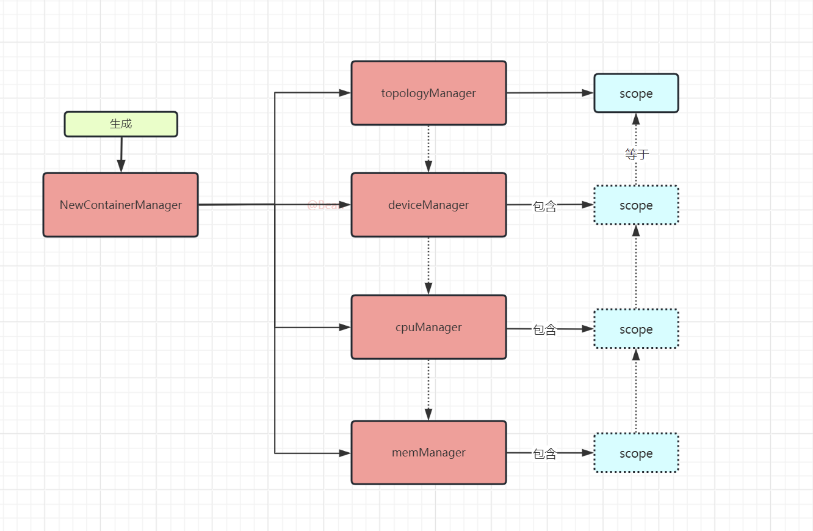

但它们的关系其实挺复杂的：

- topologyManager 生成对象后会包含一个 scope 变量，用来存储 Pod 的 NUMA 信息。而其它三个 Manager 在生成时就将 topologyManager 作为参数，以获取到 scope。相当于共享一个变量，所以当三个 manager 操作 scope 时，需要请求内存锁
- 而三个 Manager 每当生成完成后，topologyManager 会使用 AddHintProvider 方法，将它们再存入到自己的 provider 中，这样就可以调用它们的 NUMA 计算方法

#### 1.3.1.3. 总结

这里我们分析了 containerManager 和它的四个子 Manager 的运行机制及逻辑关系。

### 1.3.2. topologyManager

#### 1.3.2.1. 全景：先看清概念与调用关系

topologyManager 是 kubelet 准入链（canAdmitPod）上的 NUMA 裁决者。它本身不直接管理任何资源，而是协调 cpuManager、memoryManager、deviceManager 三个子 Manager：先收集各方给出的"资源可以放在哪些 NUMA 节点上"的候选方案（hints），合并出一个最优方案（bestHint），再让各子 Manager 按这个方案执行真正的分配。

先记住几个贯穿全章的概念：

| 概念 | 含义 |
|---|---|
| TopologyHint | 一个候选方案：`{NUMANodeAffinity: NUMA 掩码, Preferred: 是否最优}`，表示"这批资源可以放在掩码覆盖的 NUMA 节点上" |
| Preferred | hint 的"最优"标记，掩码覆盖 NUMA 节点数最少的 hint 才会被标记，供 Merge 优先选择 |
| HintProvider | 接口，cpu/memory/device 三个子 Manager 都实现了它的 `GetPodTopologyHints` 方法 |
| bestHint | Merge 从所有 providersHints 中合并出的最终唯一方案，是分配阶段使用的"答案" |
| scope | topologyManager 的作用域对象，持有 hintProviders、policy，并把 bestHint 存入自己的 podTopologyHints |
| NUMA 掩码 | 用 bit0~bitN 对应 node0~nodeN 的位串，如 `00000011` 表示 node0+node1（详见 1.3.2.3.1） |

整个章节的函数调用关系如下（这也是后续小节的阅读路线）：

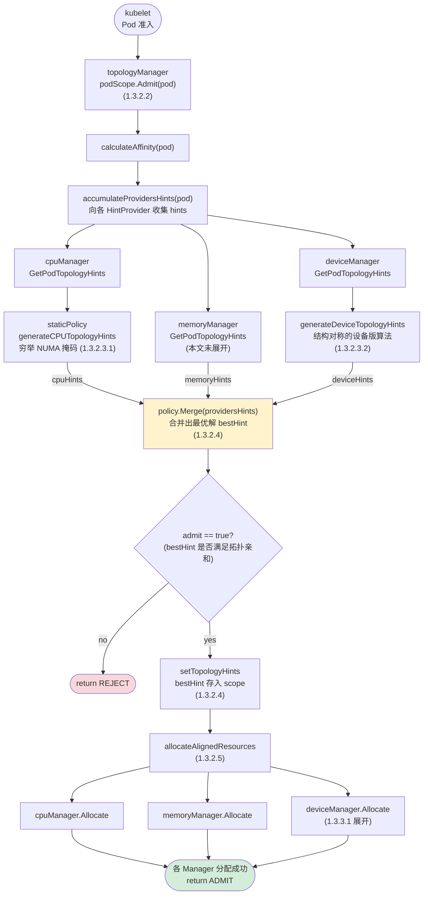

对应三层职责：

1. **收集层**（1.3.2.3）：`Admit → calculateAffinity → accumulateProvidersHints`，向 cpu/memory/device 三个子 Manager 逐一调用 `GetPodTopologyHints`（HintProvider 接口），各 Manager 内部再委托私有的 `generateCPUTopologyHints` / `generateDeviceTopologyHints` 穷举 NUMA 掩码生成 hints。
2. **决策层**（1.3.2.4）：`policy.Merge` 将三份 hints 合并出唯一的 bestHint，并决定 admit 与否；`setTopologyHints` 把 bestHint 存入 scope，供后续分配使用。
3. **执行层**（1.3.2.5 与 1.3.3）：`allocateAlignedResources` 遍历 hintProviders，调用各子 Manager 的 `Allocate` 方法完成 CPU、内存、设备的真正分配（deviceManager 侧的分配细节见 1.3.3.1）。

一句话总结 topology 的计算逻辑：在为 Pod 分配 device 等资源时进行 bestHint 的选择，以求达到 NUMA 与设备的对应，从而提高性能。

#### 1.3.2.2. 准入入口：Admit 方法

> 函数定位：topologyManager 的**准入裁决入口**。它在 kubelet 的 canAdmitPod 准入链中被调用（见下方调用链），负责协调三个子 Manager：先通过 `calculateAffinity` 收集各 Manager 的 hints 并 Merge 出 bestHint，再让各 Manager 按 bestHint 执行真正的资源分配。所有 HintProvider 的 GetPodTopologyHints 都是由它触发的。

它的调用逻辑是这样的：

`kubelet.Run --> kubelet.syncLoop --> kubelet.syncLoopIteration --> kubelet.HandlePodAdditions --> kubelet.canAdmitPod --> topologyManager.scope_pod.Admit`

这条链路描述的是"新 Pod 落到本节点后，kubelet 决定收不收"的过程：

```text
kubelet.Run                    # kubelet 进程启动
  └─ syncLoop                  # 核心事件主循环（每秒 tick 一次）
      └─ syncLoopIteration     # 单次循环：从多个 channel 消费事件
          └─ HandlePodAdditions   # 消费到"Pod 新增/更新"事件（来自 API watch）
              └─ canAdmitPod      # 准入检查：遍历所有 AdmitHandler
                  └─ topologyManager.Admit   # 其中之一：NUMA 亲和性裁决
```

- 触发源：Pod 被 scheduler 绑定到本节点后，kubelet 通过 watch 感知到新 Pod，`syncLoopIteration` 从 podUpdate channel 读到，进入 `HandlePodAdditions`
- canAdmitPod 是准入链：它不只是调 topologyManager，而是遍历一组 PodAdmitHandler（设备、资源管理器等都有各自的 Admit），任何一个返回 reject 都会导致 Pod 创建失败
- topologyManager.Admit 是链上的一环：负责 NUMA 维度的裁决——算出 bestHint、存入 scope、触发各子 Manager 按对齐语义分配资源

最终会调用到 topologymanager 目录下 scope_pod.go 的 Admit 方法。当然，除了 containerManager 外，许多其它的 Manager 也有 Admit 方法。

```go
func (s *podScope) Admit(pod *v1.Pod) lifecycle.PodAdmitResult {
    bestHint, admit := s.calculateAffinity(pod)
    klog.InfoS("Best TopologyHint", "bestHint", bestHint, "pod", klog.KObj(pod))
    if !admit {
        metrics.TopologyManagerAdmissionErrorsTotal.Inc()
        return admission.GetPodAdmitResult(&TopologyAffinityError{})
    }

    for _, container := range append(pod.Spec.InitContainers, pod.Spec.Containers...) {
        klog.InfoS("Topology Affinity", "bestHint", bestHint, "pod", klog.KObj(pod), "containerName", container.Name)
        s.setTopologyHints(string(pod.UID), container.Name, bestHint)

        err := s.allocateAlignedResources(pod, &container)
        if err != nil {
            metrics.TopologyManagerAdmissionErrorsTotal.Inc()
            return admission.GetPodAdmitResult(err)
        }
    }
    if IsAlignmentGuaranteed(s.policy) {
        // increment only if we know we allocate aligned resources.
        klog.V(4).InfoS("Resource alignment at pod scope guaranteed", "pod", klog.KObj(pod))
        metrics.ContainerAlignedComputeResources.WithLabelValues(metrics.AlignScopePod, metrics.AlignedNUMANode).Inc()
    }
    return admission.GetPodAdmitResult(nil)
}

func (s *podScope) accumulateProvidersHints(pod *v1.Pod) []map[string][]TopologyHint {
    var providersHints []map[string][]TopologyHint

    for _, provider := range s.hintProviders {
        // Get the TopologyHints for a Pod from a provider.
        hints := provider.GetPodTopologyHints(pod)
        providersHints = append(providersHints, hints)
        klog.InfoS("TopologyHints", "hints", hints, "pod", klog.KObj(pod))
    }
    return providersHints
}

func (s *podScope) calculateAffinity(pod *v1.Pod) (TopologyHint, bool) {
    providersHints := s.accumulateProvidersHints(pod)
    bestHint, admit := s.policy.Merge(providersHints)
    klog.InfoS("PodTopologyHint", "bestHint", bestHint, "pod", klog.KObj(pod))
    return bestHint, admit
}
```

我们可以通过代码总结出几大步骤：

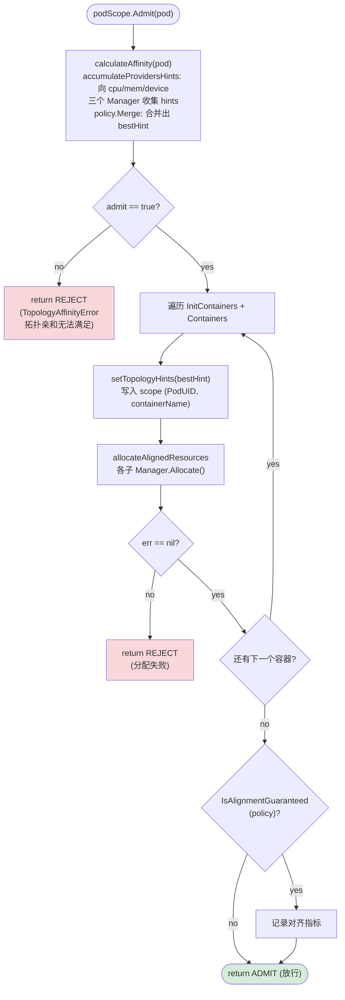

对照代码再总结几大步骤：

- 先执行 accumulateProvidersHints，根据 cpuManager、memoryManager 和 deviceManager 的 GetPodTopologyHints 算出各自的 hints
- 然后执行 Merge 方法。通过这个方法名我们也能知道，它是做合并的，即算出这几个 hints 的最优集，最终得到 bestHint。（不同的 NUMA 策略有不同的合并算法，这个以后再说）
- 选出 bestHint 后，通过 setTopologyHints 将信息存入 Pod 对应的 scope 中
- 最后通过 allocateAlignedResources 让各个 manager 进行真正的资源分配

注意 `s.setTopologyHints(string(pod.UID), container.Name, bestHint)` 这行代码，它为 Pod 在当前的 scope 中添加了一个 bestHint。

#### 1.3.2.3. 收集层：三个子 Manager 的 GetPodTopologyHints

> 函数定位：`GetPodTopologyHints` 是 topologyManager 定义的 **HintProvider 接口方法**，cpu/memory/device 三个子 Manager 都要实现它。本节依次分析三者的实现：cpuManager（1.3.2.3.1）、deviceManager（1.3.2.3.2）、memoryManager（1.3.2.3.3）。

##### 1.3.2.3.1. cpuManager：NUMA 掩码与 generateCPUTopologyHints

> 函数定位：cpuManager 版本的 `GetPodTopologyHints` 负责从 pod 中解析出 CPU 请求，然后委托给内部私有的 `generateCPUTopologyHints`（本小节）执行真正的掩码穷举算法。

这个函数在 cpuManager 的 policy_static.go 中。

一般情况下，本机的 kubelet 会指定一种 CPU 策略。当它作为 KubeVirt 节点时，建议设置为 static（cpu-manager-policy），这样才能进行 CPU 的固定分配。而当为 none 或 options 时，则没有 GetPodTopologyHints 的算法实现，或者会被返回 nil。

这里我们不分析这个函数本身，而是分析被它调用的 generateCPUTopologyHints 函数。

**（1）NUMA 掩码**

在具体分析之前，我们先看下 NUMA 的掩码是怎么算的。

```text
          bit7  bit6  bit5  bit4  bit3  bit2  bit1  bit0
         +-----+-----+-----+-----+-----+-----+-----+-----+
node     |  7  |  6  |  5  |  4  |  3  |  2  |  1  |  0  |
         +-----+-----+-----+-----+-----+-----+-----+-----+
mask     |  0  |  0  |  0  |  0  |  0  |  0  |  1  |  1  |   → node0、node1
         +-----+-----+-----+-----+-----+-----+-----+-----+
mask     |  1  |  0  |  0  |  0  |  0  |  0  |  0  |  1  |   → node7、node0
         +-----+-----+-----+-----+-----+-----+-----+-----+
```

即掩码串书写为“左 bit7（高位）、右 bit0（低位）”，与二进制的阅读方向一致：node0 对应最右位（`00000001`），node7 对应最左位（`10000000`）。

假设你有一个系统，其中有 8 个 NUMA 节点（编号为 0 到 7）。每个 NUMA 节点可以用一个位来表示：

- 节点 0：`00000001`
- 节点 1：`00000010`
- 节点 2：`00000100`
- 节点 3：`00001000`
- 节点 4：`00010000`
- 节点 5：`00100000`
- 节点 6：`01000000`
- 节点 7：`10000000`

多个节点可以用掩码按位组合来表示。比如 00000011 表示节点 0、1，10000001 表示节点 7、0。

在接下来的分析中，我们会看到 NUMA 节点会被遍历（穷举）组成不同的组合，直到 11111111。非空组合共有 255 个，即 2^8 - 1 个（算上空掩码则是 2^8 = 256 个）。

**（2）generateCPUTopologyHints 方法**

> 函数定位：cpuManager（staticPolicy）的**私有算法函数**，不对外暴露。它接收已解析好的 availableCPUs、reusableCPUs、request 三个参数，穷举 NUMA 掩码组合生成 TopologyHint 列表并标记 Preferred。调用链：`topologyManager.Admit → accumulateProvidersHints → cpuManager.GetPodTopologyHints（接口） → 本函数`。

该方法仍在 policy_static.go 中。

```go
func (p *staticPolicy) generateCPUTopologyHints(availableCPUs cpuset.CPUSet, reusableCPUs cpuset.CPUSet, request int) []topologymanager.TopologyHint {
    // Initialize minAffinitySize to include all NUMA Nodes.
    minAffinitySize := p.topology.CPUDetails.NUMANodes().Size()

    // Iterate through all combinations of numa nodes bitmask and build hints from them.
    hints := []topologymanager.TopologyHint{}
    bitmask.IterateBitMasks(p.topology.CPUDetails.NUMANodes().List(), func(mask bitmask.BitMask) {
        // First, update minAffinitySize for the current request size.
        cpusInMask := p.topology.CPUDetails.CPUsInNUMANodes(mask.GetBits()...).Size()
        if cpusInMask >= request && mask.Count() < minAffinitySize {
            minAffinitySize = mask.Count()
        }

        // Then check to see if we have enough CPUs available on the current
        // numa node bitmask to satisfy the CPU request.
        numMatching := 0
        for _, c := range reusableCPUs.List() {
            // Disregard this mask if its NUMANode isn't part of it.
            if !mask.IsSet(p.topology.CPUDetails[c].NUMANodeID) {
                return
            }
            numMatching++
        }

        // Finally, check to see if enough available CPUs remain on the current
        // NUMA node combination to satisfy the CPU request.
        for _, c := range availableCPUs.List() {
            if mask.IsSet(p.topology.CPUDetails[c].NUMANodeID) {
                numMatching++
            }
        }

        // If they don't, then move onto the next combination.
        if numMatching < request {
            return
        }

        // Otherwise, create a new hint from the numa node bitmask and add it to the
        // list of hints.  We set all hint preferences to 'false' on the first
        // pass through.
        hints = append(hints, topologymanager.TopologyHint{
            NUMANodeAffinity: mask,
            Preferred:        false,
        })
    })

    // Loop back through all hints and update the 'Preferred' field based on
    // counting the number of bits sets in the affinity mask and comparing it
    // to the minAffinitySize. Only those with an equal number of bits set (and
    // with a minimal set of numa nodes) will be considered preferred.
    for i := range hints {
        if p.options.AlignBySocket && p.isHintSocketAligned(hints[i], minAffinitySize) {
            hints[i].Preferred = true
            continue
        }
        if hints[i].NUMANodeAffinity.Count() == minAffinitySize {
            hints[i].Preferred = true
        }
    }

    return hints
}
```

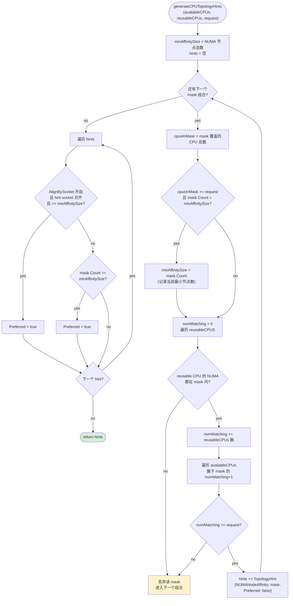

注：下面的解析中，numa 表示单个 NUMA 节点，numas 表示一个或多个 NUMA 节点的组合，mask 则是上一小节所说的 NUMA 掩码组合方式，nodeN 表示具体的 NUMA 节点。

在分析代码之前，我们先做一个假设：96 核 8 NUMA 节点的 CPU，每个节点 12 个核，要分配 16 个 CPU。并且假设 cpu0 被系统保留，那么 availableCPUs 参数将只剩 95 个核心，request 则是要请求的 CPU 数量，即 16。

```text
           node0        node1        node2        node3        node4        node5        node6        node7
         +-----+      +-----+      +-----+      +-----+      +-----+      +-----+      +-----+      +-----+
CPU 编号  |0-11 |      |12-23|      |24-35|      |36-47|      |48-59|      |60-71|      |72-83|      |84-95|
         +-----+      +-----+      +-----+      +-----+      +-----+      +-----+      +-----+      +-----+
          12 核        12 核        12 核        12 核        12 核        12 核        12 核        12 核

  系统保留: cpu0 (node0 内)         → node0 实际可用 11 核
  总计: 96 核 - 1 保留 = availableCPUs 95 核
  request = 16 核

  结论: 95 核远够 16 核，但单个节点只有 11~12 核 < 16 核
        → 必须跨节点组合，最小组合为 2 个节点（11+12、12+12 均满足）
```

- 先初始化一个 minAffinitySize，这个变量表示我们的请求最少要使用多少个 NUMA 节点，初始值为 8。注意，这个值后期会变动
- 定义一个包含多个 TopologyHint 的 hints 变量
- 组合遍历 NUMA 节点，也就是前一小节提到的 NUMA mask 遍历，并把 mask 作为参数传入临时函数中：
  - 获取 cpusInMask，即当前 numas 中共包含多少个 CPU
  - `cpusInMask >= request && mask.Count < minAffinitySize`：如果当前遍历的 numas 的 CPU 数量达到了请求数量，并且 mask 的位数小于当前 minAffinitySize 的值，那么 minAffinitySize 被赋新值
  - 初始化 numMatching 为 0，该变量表示我们能否在当前的 numas 中找到足够使用的 CPU。比如我们遍历 node0 和 node1，但这两个节点只剩 15 个 CPU 可用
  - 遍历 reusableCPUS，这个参数一般会在 Pod 于当前节点升级时使用，表示当前 Pod 是否使用了这些节点中的 CPU，这里先不用管
  - 遍历 availableCPUs，如果 CPU 属于当前 numa，那么 numMatching+1
  - 最后判断 numMatching 是否小于 request。如果小于，说明当前遍历到的 numas 所包含的 CPU 数量不满足请求，退出本次循环继续下一轮；否则，表示当前遍历到的 numas 满足了请求的数量，继续。（也会发生大于的情况，即 numas 所包含的 CPU 数量超过请求，这也是满足的）
  - 添加一个 TopologyHint 对象到 hints 中，注意这时候的 Preferred 值为 false
- 再遍历 hints 的结果：
  - 如果当前的 staticPolicy 设置了 Socket 亲近性，那么设置当前 hint 的 Preferred 为 true，表示该 hint 会被"喜欢"（即优先使用）。但要注意，在这个判断里面，同样要求其等于 minAffinitySize
  - 如果当前 hint 选中的 NUMA 节点数量等于 minAffinitySize，那么它也会是 Preferred 为 true，优先被使用

---

- q: socket 亲近性到底开不开？
  - a: 从代码来看，这是非强制性的。即使两个 NUMA 跨了 socket，hint 仍然会被置为 Preferred=true。因为代码并没有在不满足条件时退出循环，而是会继续走下一步的判断。所以如果选中了 node3+node4 作为第一个 hint，它仍然会被置为 true。

**（3）手动算一下**

我们根据上面的算法手动算一遍。假设有 8 个 NUMA 节点，每个节点仍是 12 个 CPU。其中 node0 被占用了 4 个 CPU，node1 被占用了 6 个（两个节点合计剩余 14 个 CPU），其它 node 没有被占用的 CPU。

```text
            node0      node1      node2      node3      node4      node5      node6      node7
           +------+   +------+   +------+   +------+   +------+   +------+   +------+   +------+
 剩余 CPU  |  8   |   |  6   |   |  12  |   |  12  |   |  12  |   |  12  |   |  12  |   |  12  |
           +------+   +------+   +------+   +------+   +------+   +------+   +------+   +------+
             ▲          ▲
             └── 合计 14 ──┘

 ┌──────────────────────────────────────────────────────────────────────────────────┐
 │ request=10:  node2~node7 单节点(12)≥10 满足                     → minAffinitySize=1 │
 │              node2 排最前，Preferred                                   │
 │ request=14:  单节点均不足；两两组合中 node0+node1=14 恰好满足        → minAffinitySize=2 │
 │              所有 2 节点组合均入 hints，均 Preferred                    │
 │ request=15:  node0+node1=14 不足；node1+node2=18 起步的组合都满足     → minAffinitySize=2 │
 │              不含 node0 的 2 节点组合才满足                             │
 └──────────────────────────────────────────────────────────────────────────────────┘
```

- 1、请求 10 个 CPU
  - node0 只剩 8 个，node1 只剩 6 个，单独都不满足；node2 有 12 个空闲，满足条件，会被放入 hints。由于 node2 是单节点即最小集，它会被优先使用
- 2、请求 14 个 CPU
  - 巧了，正好是 node0+node1 的剩余总量。但 node0、node1 单独都不满足，node2 及之后的节点单独也不满足，因为请求数超过了单个节点的剩余数量
  - 那么就会看组合：node0+node1 满足条件，node1+node2 也满足，直到 node0+...+node7 都满足，那好，全部拿出来
  - node0+node1 是相同 socket 吗？是，好，喜欢；node2+node3 是相同 socket 吗？是，好，喜欢；node3+node4 是相同 socket 吗？不是，但仍然可以被喜欢
  - node0+node1+node2+node3 不是相同 socket？是的（跨 socket 了），而且你也不是最小集
- 3、请求 15 个 CPU
  - node0+node1=14? no；node1+node2=18? yes；node2+node3=24? yes；node3+node4=24? yes

最终我们可以得出一个结论：NUMA 的 hint 算法会在一堆组合中选出满足 CPU 请求数量、NUMA 数量最小的节点组合，并且优先使用排在最前的节点。

**（4）延伸：怎么才能均匀地分配（放弃）**

本小节的思路已放弃：后面我们可以通过设置 kubelet 的方式来做到均匀分配（见 [1.6.1. CPU 均匀的分配](#161-cpu-均匀的分配) 的 distribute-cpus-across-numa）。

先说清楚我们想解决什么问题：跨 NUMA 的请求，我们希望 CPU 均匀地分布在所选的各 NUMA 节点上。比如请求 16 核、选中 node0+node1 时，理想的结果是 node0 出 8 核 + node1 出 8 核。但原生 kubelet 的分配顺序是"先填满一个节点，再用下一个"——它只会从 node0 拿满 12 核、再从 node1 拿 4 核，得到 12+4 的倾斜结果。也就是说，原生机制只保证"落在选中的节点集合内"，不保证"节点间均匀"。

我们尝试的解决办法是：用保留 CPU（reserved-cpus）人为地把每个节点的可用 CPU 数量裁剪成一样的，让"填满一个再下一个"的顺序分配自然产生均匀的效果：

```text
原生 static 策略（每节点 12 核，无保留）:
            node0                node1
        +------------+       +------------+
        |■■■■■■■■■■■■|       |■■■■        |     ■ = 分配给 Pod 的 CPU
        +------------+       +------------+
          12 核                  4 核        → 12+4，不均匀

设置 reserved-cpus（每节点保留 4 核，各剩 8 核）:
            node0                node1
        +------------+       +------------+
        |■■■■■■■■    |       |■■■■■■■■    |     口 = 保留 CPU
        +------------+       +------------+
        |口口口口      |       |口口口口      |
        +------------+       +------------+
          8 核                   8 核        → 8+8，均匀
```

代价是每张显卡最多只能用到"裁剪后"的核数，被保留的 CPU 不能分配给 Pod。因此保留量的选择直接决定均匀性和可用容量的平衡，这正是下面几段要讨论的内容。

当我们将一个 8 卡节点分配给不同用户使用时，希望用户不论使用几卡，所对应的 CPU 数量都是一样的。

```yaml
NUMA:
  NUMA node(s):           8
  NUMA node0 CPU(s):      0-5,48-53
  NUMA node1 CPU(s):      6-11,54-59
  NUMA node2 CPU(s):      12-17,60-65
  NUMA node3 CPU(s):      18-23,66-71
  NUMA node4 CPU(s):      24-29,72-77
  NUMA node5 CPU(s):      30-35,78-83
  NUMA node6 CPU(s):      36-41,84-89
  NUMA node7 CPU(s):      42-47,90-95
```

比如，当前节点是 96 核，我们设置每个 NUMA 节点保留 1 个 CPU，即 0、6、12、18、24、30、36、42 将被保留。那么每个 node 剩余 11 个 CPU，建议每张显卡分配 11 个 CPU，这样才能保证显卡对应的 NUMA 节点选取最合适，也不会产生不均匀的情况。

如果只设置 0、6、12、18 为保留：用到 node3+node4 时仍然会是 11+11 的效果，但 node4+node5 就会产生 12+10 的效果，每张显卡被分配的 CPU 就不均匀了。

如果只设置 0、6、12、18 为保留，并且每张显卡使用 10 个 CPU：用到 node0+node1 时就会发生 11+9 的情况，用到 node4+node5 时则会发生 12+8 的情况。

```text
保留不完全时，node 间可用核数不一致，均匀性被打破
（仅保留 node0~3 各 1 核 → node0~3 可用 11 核，node4~7 可用 12 核）

 显卡 A 落在 node3+node4:   node3      node4        显卡 B 落在 node4+node5:   node4      node5
                          +------+   +------+                              +------+   +------+
                          |■■■■■ |   |■■■■■|                              |■■■■■ |   |■■■■ |
                          | ■■■■ |   | ■■■■|   → 11+11 均匀               |  ■■■ |   |  ■■  |  → 12+10 不均
                          +------+   +------+     (恰好凑巧)               +------+   +------+    匀

 同样保留下，每卡请求 10 核:  node0      node1                              node4      node5
                          +------+   +------+                              +------+   +------+
                          |■■■■■ |   |■■■■ |                              |■■■■■ |   |■■■  |
                          | ■■■■ |   |  ■  |   → 11+9 不均匀              |  ■■■ |   |      |  → 12+8 不均
                          +------+   +------+                              +------+   +------+    匀
```

两种失败模式的根源相同：保留没有覆盖所有节点（或请求数不是裁剪后核数的整数倍），各节点“可被顺序拿走的核数”不一致，先填满的节点总是多占。这也再次印证：reserved-cpus 只是特定数字组合下的巧合，通用方案见 1.6.1 的 distribute-cpus-across-numa。

##### 1.3.2.3.2. deviceManager：GetPodTopologyHints 与 generateDeviceTopologyHints

> 函数定位：与 1.3.2.3.1 的 cpuManager 版本**同名同接口**（HintProvider 接口），但实现完全不同——它多了一道关键前置检查：`deviceHasTopologyAlignment` 检查设备的插件是否上报过拓扑信息。GPU 场景正是卡在这一步（返回 nil），根本走不到后面的 `generateDeviceTopologyHints` 算法。这也正是第 1 章要修改 device-plugin 上报拓扑的原因。

**（1）GetPodTopologyHints 方法**

```go
func (m *ManagerImpl) GetPodTopologyHints(pod *v1.Pod) map[string][]topologymanager.TopologyHint {
    // Garbage collect any stranded device resources before providing TopologyHints
    m.UpdateAllocatedDevices()

    deviceHints := make(map[string][]topologymanager.TopologyHint)
    accumulatedResourceRequests := m.getPodDeviceRequest(pod)

    m.mutex.Lock()
    defer m.mutex.Unlock()
    for resource, requested := range accumulatedResourceRequests {
        // Only consider devices that actually contain topology information.
        if aligned := m.deviceHasTopologyAlignment(resource); !aligned {
            klog.InfoS("Resource does not have a topology preference", "resourceName", resource, "pod", klog.KObj(pod), "request", requested)
            deviceHints[resource] = nil
            continue
        }

        // Short circuit to regenerate the same hints if there are already
        // devices allocated to the Pod. This might happen after a
        // kubelet restart, for example.
        allocated := m.podDevices.podDevices(string(pod.UID), resource)
        if allocated.Len() > 0 {
            if allocated.Len() != requested {
                klog.InfoS("Resource already allocated to pod with different number than request", "resourceName", resource, "pod", klog.KObj(pod), "request", requested, "allocated", allocated.Len())
                deviceHints[resource] = []topologymanager.TopologyHint{}
                continue
            }
            klog.InfoS("Regenerating TopologyHints for resource already allocated to pod", "resourceName", resource, "pod", klog.KObj(pod), "allocated", allocated.Len())
            deviceHints[resource] = m.generateDeviceTopologyHints(resource, allocated, sets.Set[string]{}, requested)
            continue
        }

        // Get the list of available devices, for which TopologyHints should be generated.
        available := m.getAvailableDevices(resource)
        if available.Len() < requested {
            klog.InfoS("Unable to generate topology hints: requested number of devices unavailable", "resourceName", resource, "pod", klog.KObj(pod), "request", requested, "available", available.Len())
            deviceHints[resource] = []topologymanager.TopologyHint{}
            continue
        }

        // Generate TopologyHints for this resource given the current
        // request size and the list of available devices.
        deviceHints[resource] = m.generateDeviceTopologyHints(resource, available, sets.Set[string]{}, requested)
    }

    return deviceHints
}
```

我们来简单地分析下：

- 定义 deviceHints
- 获取 Pod 的 device 请求，存入 accumulatedResourceRequests。注意，这时候我们并没有分配具体的 device，只是看到 Pod 请求了一个或多个 device
- 循环 resource 和 requested，即名称和数量。注意，这里的 resource 还可以包含其它 device，比如 KubeVirt 的 tun 设备：
  - 检查该 resource 是否包含拓扑定义，如果没有，则忽略并返回 nil；如果有，则 aligned=true。（在我们的场景中，这一步已经进行不下去了，因为 GPU 根本没有上报拓扑信息）
  - 获取已分配的设备存入 allocated 变量。和 cpuManager 一样，Pod 是可以本地升级的
  - 如果 allocated 的数量 > 0，证明这个 Pod 是已存在的，现在只是要重建它：
    - 如果 allocated 不等于 requested，则直接为资源赋值一个空的 hints
    - 如果相等，则按照当前 allocated 直接生成 hints。（两个分支都会直接跳出本次循环）
  - 获取当前资源的可用数量 available
    - 如果 `available < requested`，那么同样是空 hints，并跳出本次循环
  - 当以上的条件都没有跳出循环时，最后才会进入 hints 生成

注意，上面有一处是赋值为 nil 且跳过，另外三处是赋值为空且跳过。对于定义为存放多个对象的切片来说，nil 也是可以被添加的。


**（2）generateDeviceTopologyHints 方法**

> 函数定位：deviceManager 的**私有算法函数**，与 cpuManager 的 `generateCPUTopologyHints`（1.3.2.3.1）**结构对称**——同样穷举 NUMA 掩码组合生成 hints、选出 preferred，只是输入从 CPU 集合换成了设备集合（来源是 device plugin 上报的 Device.Topology）。

deviceManager 的 generateDeviceTopologyHints 函数相对比较简单，这里请自行查阅。它的目标也是生成一个 topologyHints 列表，然后选出 preferred 的。

##### 1.3.2.3.3. memoryManager：calculateHints 与掩码穷举

> 函数定位：memoryManager 版本的 `GetPodTopologyHints` 负责从 pod 中解析出内存请求，然后委托给内部私有的 `calculateHints`（本小节）执行真正的掩码穷举算法，输入是 machineState（kubelet 启动时为每个 NUMA 节点记录的内存账本）。

```go
func (p *staticPolicy) calculateHints(machineState state.NUMANodeMap, pod *v1.Pod, requestedResources map[v1.ResourceName]uint64) map[string][]topologymanager.TopologyHint {
    var numaNodes []int
    for n := range machineState {
        numaNodes = append(numaNodes, n)
    }
    sort.Ints(numaNodes)

    // Initialize minAffinitySize to include all NUMA Cells.
    minAffinitySize := len(numaNodes)

    hints := map[string][]topologymanager.TopologyHint{}
    bitmask.IterateBitMasks(numaNodes, func(mask bitmask.BitMask) {
        maskBits := mask.GetBits()
        singleNUMAHint := len(maskBits) == 1

        totalFreeSize := map[v1.ResourceName]uint64{}
        totalAllocatableSize := map[v1.ResourceName]uint64{}
        // calculate total free and allocatable memory for the node mask
        for _, nodeID := range maskBits {
            for resourceName := range requestedResources {
                if _, ok := totalFreeSize[resourceName]; !ok {
                    totalFreeSize[resourceName] = 0
                }
                totalFreeSize[resourceName] += machineState[nodeID].MemoryMap[resourceName].Free

                if _, ok := totalAllocatableSize[resourceName]; !ok {
                    totalAllocatableSize[resourceName] = 0
                }
                totalAllocatableSize[resourceName] += machineState[nodeID].MemoryMap[resourceName].Allocatable
            }
        }

        // verify that for all memory types the node mask has enough allocatable resources
        for resourceName, requestedSize := range requestedResources {
            if totalAllocatableSize[resourceName] < requestedSize {
                return
            }
        }

        // set the minimum amount of NUMA nodes that can satisfy the container resources requests
        if mask.Count() < minAffinitySize {
            minAffinitySize = mask.Count()
        }

        // the node already in group with another node, it can not be used for the single NUMA node allocation
        if singleNUMAHint && len(machineState[maskBits[0]].Cells) > 1 {
            return
        }

        for _, nodeID := range maskBits {
            // the node already used for the memory allocation
            if !singleNUMAHint && machineState[nodeID].NumberOfAssignments > 0 {
                // the node used for the single NUMA memory allocation, it can not be used for the multi NUMA node allocation
                if len(machineState[nodeID].Cells) == 1 {
                    return
                }

                // the node already used with different group of nodes, it can not be use with in the current hint
                if !areGroupsEqual(machineState[nodeID].Cells, maskBits) {
                    return
                }
            }
        }

        // verify that for all memory types the node mask has enough free resources
        for resourceName, requestedSize := range requestedResources {
            podReusableMemory := p.getPodReusableMemory(pod, mask, resourceName)
            if totalFreeSize[resourceName]+podReusableMemory < requestedSize {
                return
            }
        }

        // add the node mask as topology hint for all memory types
        for resourceName := range requestedResources {
            if _, ok := hints[string(resourceName)]; !ok {
                hints[string(resourceName)] = []topologymanager.TopologyHint{}
            }
            hints[string(resourceName)] = append(hints[string(resourceName)], topologymanager.TopologyHint{
                NUMANodeAffinity: mask,
                Preferred:        false,
            })
        }
    })

    // update hints preferred according to multiNUMAGroups, in case when it wasn't provided, the default
    // behaviour to prefer the minimal amount of NUMA nodes will be used
    for resourceName := range requestedResources {
        for i, hint := range hints[string(resourceName)] {
            hints[string(resourceName)][i].Preferred = p.isHintPreferred(hint.NUMANodeAffinity.GetBits(), minAffinitySize)
        }
    }

    return hints
}
```

以上代码仍然沿用了 cpuManager 中的逻辑，其中的 minAffinitySize 是最大的问题。如果一个 node 的剩余内存就已经满足了条件，那么就会产生这样的结果：

- cpuManager 选择了 node0+node1 两个 node，因为它需要两个 node 才能满足 CPU 数量的请求
- 但 memoryManager 却只选择了 node0，因为一个内存节点就可以满足内存的请求了
- 那么结果就会导致 cpuManager 和 memoryManager 的 hints 无法计算出有效交集（Merge 失败，Pod 被拒绝）

所以结论是：我们必须强行让内存与 CPU 对应，以保证选出的 CPU 与内存的 NUMA 集一致。

#### 1.3.2.4. 决策层：Merge 出 bestHint 并存入 scope

注意，这时候又回到了 topologyManager 中——Admit 的 `calculateAffinity` 后半段。

**（1）Merge 方法**

再回到 Admit 方法，我们会看到多个 Manager 的 hints 返回会被塞入 Merge 方法中，Merge 方法会计算多个 hints 结果的最优选择。（这里我们以后再具体分析）

```go
func (s *podScope) calculateAffinity(pod *v1.Pod) (TopologyHint, bool) {
    providersHints := s.accumulateProvidersHints(pod)
    bestHint, admit := s.policy.Merge(providersHints)
    klog.InfoS("PodTopologyHint", "bestHint", bestHint, "pod", klog.KObj(pod))
    return bestHint, admit
}
```

**（2）存入 scope**

```go
s.setTopologyHints(string(pod.UID), container.Name, bestHint)
```

```go
type scope struct {
    mutex sync.Mutex
    name  string
    // Mapping of a Pods mapping of Containers and their TopologyHints
    // Indexed by PodUID to ContainerName
    podTopologyHints podTopologyHints
    // The list of components registered with the Manager
    hintProviders []HintProvider
    // Topology Manager Policy
    policy Policy
    // Mapping of (PodUid, ContainerName) to ContainerID for Adding/Removing Pods from PodTopologyHints mapping
    podMap containermap.ContainerMap
}
```

在以上代码中，我们看到当前 Pod 的 bestHint 被存入了 scope 的 podTopologyHints 中。每个 Pod 会对应一个 bestHint。

#### 1.3.2.5. 执行层：allocateAlignedResources

```go
// err := s.allocateAlignedResources(pod, &container)
func (s *scope) allocateAlignedResources(pod *v1.Pod, container *v1.Container) error {
    for _, provider := range s.hintProviders {
        err := provider.Allocate(pod, container)
        if err != nil {
            return err
        }
    }
    return nil
}
```

allocateAlignedResources 又会调用每个子 Manager 的 Allocate 方法，进行真正的分配。这个我们新开一个章节（1.3.3）来分析。

### 1.3.3. 分配（执行层详解）

在 topologyManager 的方法中，最后会调用 allocateAlignedResources 方法，该方法再去每个子 Manager 执行 Allocate 方法。

- q: 这时候 device 被分配了吗？
  - a: 分了，但没有完全分。以 GPU 为例，此时我们还只知道被分配了几个 GPU，并不知道 GPU 的具体情况。
- q: 多个 Pod 会同时分配吗？
  - a: 不会。从 loop 入口可以看到，它是一个循环执行的机制，如果有多个 Pod 的请求，它们是顺序执行的，完成一个分配后才会执行下一个。

#### 1.3.3.1. Allocate 方法

这里我们以 DeviceManager 的 Allocate 方法来分析分配机制。

```go
func (m *ManagerImpl) Allocate(pod *v1.Pod, container *v1.Container) error {
    if _, ok := m.devicesToReuse[string(pod.UID)]; !ok {
        m.devicesToReuse[string(pod.UID)] = make(map[string]sets.Set[string])
    }
    // If pod entries to m.devicesToReuse other than the current pod exist, delete them.
    for podUID := range m.devicesToReuse {
        if podUID != string(pod.UID) {
            delete(m.devicesToReuse, podUID)
        }
    }
    // Allocate resources for init containers first as we know the caller always loops
    // through init containers before looping through app containers. Should the caller
    // ever change those semantics, this logic will need to be amended.
    for _, initContainer := range pod.Spec.InitContainers {
        if container.Name == initContainer.Name {
            if err := m.allocateContainerResources(pod, container, m.devicesToReuse[string(pod.UID)]); err != nil {
                return err
            }
            if !podutil.IsRestartableInitContainer(&initContainer) {
                m.podDevices.addContainerAllocatedResources(string(pod.UID), container.Name, m.devicesToReuse[string(pod.UID)])
            } else {
                // If the init container is restartable, we need to keep the
                // devices allocated. In other words, we should remove them
                // from the devicesToReuse.
                m.podDevices.removeContainerAllocatedResources(string(pod.UID), container.Name, m.devicesToReuse[string(pod.UID)])
            }
            return nil
        }
    }
    if err := m.allocateContainerResources(pod, container, m.devicesToReuse[string(pod.UID)]); err != nil {
        return err
    }
    m.podDevices.removeContainerAllocatedResources(string(pod.UID), container.Name, m.devicesToReuse[string(pod.UID)])
    return nil
    }
```

用一张图来表示 `Allocate` 方法的大致流程（只关注本函数自身的逻辑，子函数细节见 1.3.3.1.1）：

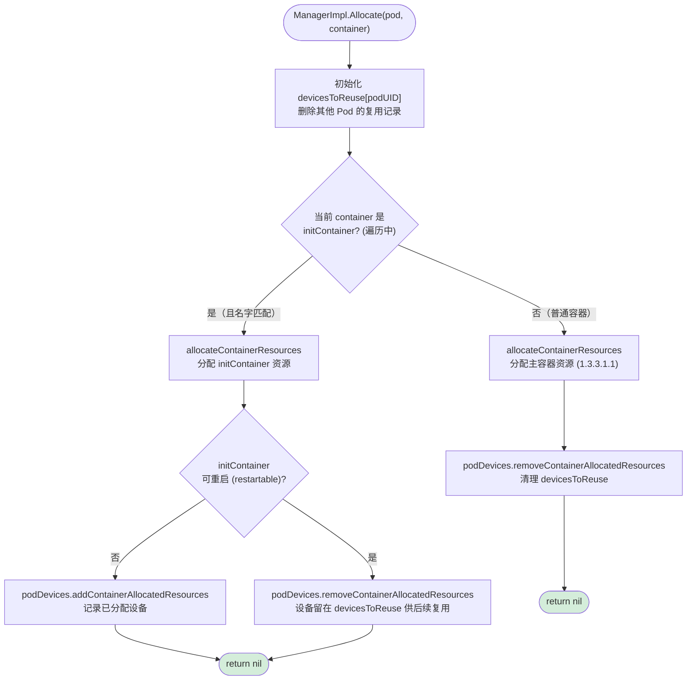

如果以单纯的 KubeVirt Pod 来分析，它会直接进入最后一个 allocateContainerResources 方法。

注：initContainer 机制我们以后再说，目前 KubeVirt 的 Pod 是没有 initContainer 机制的。

##### 1.3.3.1.1. allocateContainerResources

```go
func (m *ManagerImpl) allocateContainerResources(pod *v1.Pod, container *v1.Container, devicesToReuse map[string]sets.Set[string]) error {
    podUID := string(pod.UID)
    contName := container.Name
    allocatedDevicesUpdated := false
    needsUpdateCheckpoint := false
    // Extended resources are not allowed to be overcommitted.
    // Since device plugin advertises extended resources,
    // therefore Requests must be equal to Limits and iterating
    // over the Limits should be sufficient.
    for k, v := range container.Resources.Limits {
        resource := string(k)
        needed := int(v.Value())
        klog.V(3).InfoS("Looking for needed resources", "resourceName", resource, "pod", klog.KObj(pod), "containerName", container.Name, "needed", needed)
        if !m.isDevicePluginResource(resource) {
            continue
        }
        // Updates allocatedDevices to garbage collect any stranded resources
        // before doing the device plugin allocation.
        if !allocatedDevicesUpdated {
            m.UpdateAllocatedDevices()
            allocatedDevicesUpdated = true
        }
        allocDevices, err := m.devicesToAllocate(podUID, contName, resource, needed, devicesToReuse[resource])
        if err != nil {
            return err
        }
        if allocDevices == nil || len(allocDevices) <= 0 {
            continue
        }

        needsUpdateCheckpoint = true

        startRPCTime := time.Now()

        m.mutex.Lock()
        eI, ok := m.endpoints[resource]
        m.mutex.Unlock()
        if !ok {
            m.mutex.Lock()
            m.allocatedDevices = m.podDevices.devices()
            m.mutex.Unlock()
            return fmt.Errorf("unknown Device Plugin %s", resource)
        }

        devs := allocDevices.UnsortedList()
        // TODO: refactor this part of code to just append a ContainerAllocationRequest
        // in a passed in AllocateRequest pointer, and issues a single Allocate call per pod.
        klog.V(4).InfoS("Making allocation request for device plugin", "devices", devs, "resourceName", resource, "pod", klog.KObj(pod), "containerName", container.Name)
        resp, err := eI.e.allocate(devs)
        metrics.DevicePluginAllocationDuration.WithLabelValues(resource).Observe(metrics.SinceInSeconds(startRPCTime))
        if err != nil {
            // In case of allocation failure, we want to restore m.allocatedDevices
            // to the actual allocated state from m.podDevices.
            m.mutex.Lock()
            m.allocatedDevices = m.podDevices.devices()
            m.mutex.Unlock()
            return err
        }

        if len(resp.ContainerResponses) == 0 {
            return fmt.Errorf("no containers return in allocation response %v", resp)
        }

        allocDevicesWithNUMA := checkpoint.NewDevicesPerNUMA()
        // Update internal cached podDevices state.
        m.mutex.Lock()
        for dev := range allocDevices {
            if m.allDevices[resource][dev].Topology == nil || len(m.allDevices[resource][dev].Topology.Nodes) == 0 {
                allocDevicesWithNUMA[nodeWithoutTopology] = append(allocDevicesWithNUMA[nodeWithoutTopology], dev)
                continue
            }
            for idx := range m.allDevices[resource][dev].Topology.Nodes {
                node := m.allDevices[resource][dev].Topology.Nodes[idx]
                allocDevicesWithNUMA[node.ID] = append(allocDevicesWithNUMA[node.ID], dev)
            }
        }
        m.mutex.Unlock()
        m.podDevices.insert(podUID, contName, resource, allocDevicesWithNUMA, resp.ContainerResponses[0])
    }

    if needsUpdateCheckpoint {
        return m.writeCheckpoint()
    }

    return nil
}
```

用一张图来表示 `allocateContainerResources` 的大致流程（`filterByAffinity` 等 `devicesToAllocate` 内部细节见 1.3.3.1.2）：

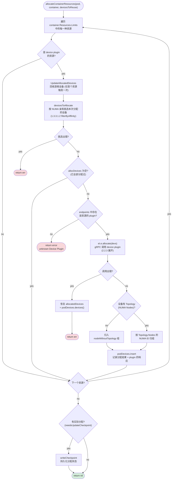

- 获取 needed=request，也就是请求的数量
- 如果当前 Pod+Container 已存在分配过的设备（主要是 Pod 升级或 kubelet 重启后会进入），新建的情况下不会进入，所以 needed 不变
- healthyDevices、hasRegistered 两个变量被定义，也不需要关心，因为 pci-passthrough 模式下没有 unhealthy 的情况
- 定义一个 allocated，来存储已经被分配的设备
- 定义一个 allocateRemainingFrom 变量（方法），当前不会执行，后面会用到
- 调用一次 allocateRemainingFrom，如果当前 Pod 有可复用的资源（当前场景用不到，以后再分析）
- devicesInUse 为当前 kubelet 内存中记录的已被使用的设备
- available 为当前可用的设备
- filterByAffinity 才是真正的分配方法：aligned 是根据当前 Pod 的 bestHint 中的 NUMA 选出的 device，unaligned 是不在 bestHint 中的 NUMA 选出的 device，而 noAffinity 则是没有 NUMA 信息的 device
- 如果 aligned 的数量足以满足 needed，那么通过一系列的算法，得出分配的设备

这里看着有点乱，但实际上也不乱。因为我们当前所有的 AMD 节点都是一个 NUMA 对应一个 GPU；但到了 Intel 平台就不一定了，Intel 可能一个 NUMA 对应多个 GPU，所以上面的代码中做了很多判断。

还有一种情况是 tun 设备。tun 设备是一种高性能的虚拟网卡，通常在网卡硬件卸载时出现，也可能出现一个 NUMA 对应 n 个 tun 设备的现象，当有多块 PCI 网卡时也可能出现。

##### 1.3.3.1.2. filterByAffinity

这个小节回答的是 1.3.2 留下的最后一个问题：**Admit 阶段算出的 bestHint，到底是怎么变成 Pod 拿到的具体设备的？**

从 Pod 入口到本函数的完整调用链如下（标注了各函数所在位置，源码行号对应 `pkg/kubelet/cm/devicemanager/manager.go`）：

```text
kubelet.Run                                    ← kubelet 进程启动
  └─ syncLoop                                  ← 事件主循环
       └─ syncLoopIteration
            └─ HandlePodAdditions              ← watch 到新 Pod 落到本节点
                 └─ canAdmitPod                ← 准入检查链
                      └─ podScope.Admit        ★ 总的 Pod 入口（1.3.2.2）
                           ├─ calculateAffinity
                           │    ├─ accumulateProvidersHints
                           │    │    ├─ cpuManager.GetPodTopologyHints
                           │    │    ├─ memoryManager.GetPodTopologyHints
                           │    │    └─ deviceManager.GetPodTopologyHints
                           │    └─ policy.Merge → bestHint          ← 决策
                           ├─ setTopologyHints                        ← 存储
                           └─ allocateAlignedResources               ← 触发分配
                                └─ deviceManager.Allocate (L320)
                                     └─ allocateContainerResources (L801)
                                          └─ devicesToAllocate (L547)
                                               └─ filterByAffinity (L700)  ← 本节，最底层
```

先交代调用位置：`allocateContainerResources`（1.3.3.1.1）中的 `devicesToAllocate` 负责决定"本次分哪些设备"，而其中真正体现 NUMA 亲和逻辑的就是 `filterByAffinity`——它把可用设备切分成三组返回：

```text
aligned / unaligned / noAffinity = filterByAffinity(可用设备, bestHint)
```

它的第一步是取回 bestHint：

```go
hint := m.topologyAffinityStore.GetAffinity(podUID, contName)

```

方法的第一行就是获取 hint。还记得我们在 containerManager 对象（1.3.1.2）那一小节所说的吗？3 个子 Manager 其实都拿到了 topology 的 scope 对象并存储起来。而在 Admit 方法中，bestHint 生成后会存入 scope 自己的变量中。那么一切都说通了。

拿到 hint 之后，函数做的事可以概括为"**按 NUMA 归属给设备分堆**"：

1. **建立 NUMA 节点 → 设备的反向索引**：遍历所有可用设备，根据每台设备上报的 Topology（device plugin 在注册阶段上报的 NUMA 信息，正是 1.4.1 要补的东西）把它们挂到所属的 NUMA 节点下。一台设备可能关联多个 NUMA 节点；没有上报 Topology 的设备被归入一个假节点（nodeWithoutTopology）。
2. **按优先级对 NUMA 节点排序**：bestHint 掩码覆盖的节点排最前，掩码外的真实节点次之，假节点最后；同组内再按"挂的设备数"排序。
3. **按排序把设备分流成三组**：
   - **aligned**：所属 NUMA 节点在 bestHint 亲和集内 → 与 Pod 的 CPU/内存落在同一 NUMA，这是最理想的一组
   - **unaligned**：所属 NUMA 节点在亲和集外 → 跨 NUMA 的设备
   - **noAffinity**：没有上报 NUMA 信息的设备 → 无从判断对齐与否（1.4 修改前，所有 GPU 都在这一组）

注意 filterByAffinity 只做"分堆"，不做最终取舍。真正挑设备的是它的调用方 `devicesToAllocate`：按 **aligned > unaligned > noAffinity** 的优先级依次取用——只要 aligned 组能满足请求就绝不会碰另外两组，aligned 不够时才"降级"借用跨 NUMA 或无拓扑信息的设备。1.3.3.1.1 要点列表中那句"如果 aligned 的数量足以满足 needed，那么通过一系列的算法，得出分配的设备"，说的就是这个消费过程。

这也解释了 1.4 之前 GPU 对齐失效的原因：device plugin 不上报 Topology 时，所有 GPU 都落在 noAffinity 组，而 noAffinity 排在最后、且不参与对齐判断——bestHint 选得再准，设备侧也无感。

#### 1.3.3.2. 总结

在这里我们知道了 bestHint 是如何保证拿到 NUMA 节点相应的设备的。

### 1.3.4. kubelet 重启与状态恢复

kubelet 重启**不会**导致 Pod 重启：容器以 containerd 等运行时的子进程身份独立存活，kubelet 只是"记账的保姆"。重启后 kubelet 通过 watch 重新拿到本节点所有 Pod，逐个对账——容器还在就不动，只恢复记账。

恢复方式按数据的性质分两类：

| 数据 | 位置 | 恢复方式 |
|---|---|---|
| bestHint（topologyManager 的结论） | 仅内存 | **重算**：重走一遍 Admit，重新收集 hints 并 Merge |
| 分配事实（三个 Manager 各自的分配记录） | 本地 checkpoint 文件 | **读文件** + Pod 对账 |

三个子 Manager 各存一份 checkpoint，均在 `/var/lib/kubelet/` 下（文件名与定义位置均已对照 release-1.28 源码验证）：

| Manager | 文件名（源码常量） | 定义位置 | 目录 |
|---|---|---|---|
| deviceManager | `kubelet_internal_checkpoint` | `devicemanager/types.go:112` | `/var/lib/kubelet/device-plugins/` |
| cpuManager | `cpu_manager_state` | `cpumanager/cpu_manager.go:52` | `/var/lib/kubelet/` |
| memoryManager | `memory_manager_state` | `memorymanager/memory_manager.go:41` | `/var/lib/kubelet/` |

三者的恢复模式也完全一致：`NewCheckpointState` 初始化 → 读 checkpoint 文件 → 结合当前实际运行的 Pod 对账。各自存的内容则不同：

- **deviceManager**：每 Pod/容器分到的设备 ID、NUMA 信息，以及缓存的 gRPC Allocate 响应（`AllocResp`）——重建容器时直接回放，无需再问 device plugin
- **cpuManager**：默认 CPU 集、每容器的 CPU 绑定 assignments、策略名
- **memoryManager**：每 NUMA 节点的内存/hugepages 分配表

topologyManager 自己没有 checkpoint——bestHint 是从当前资源可用量**推导出的结论**而非事实，丢了重算即可（重启后资源状态可能已变化，重算反而更准）。而 cpuManager/memoryManager 的 checkpoint 中记录了策略名，若重启后发现与当前配置的策略不一致，kubelet 会拒绝启动，要求排空节点并手动删除状态文件，避免新旧策略对同一份分配状态做出矛盾解读。

## 1.4. 调整

### 1.4.1. pci-passthrough

在上一章节中，我们分析了 NUMA 的选择机制，但在 KubeVirt Pod 的生成过程中，并没有看到关于 GPU 的 NUMA 匹配。经过分析后发现，是 kubevirt-gpu-device-plugin 这个组件没有上报自己的 GPU 拓扑信息。

#### 1.4.1.1. 将 topology 上传上去

我们在分析 devicePlugin 源码时说过，topology 的获取会走不下去，也就是 GPU 不会有 numa hint，原因就是当前这个 daemon 根本没有上传 topology。

下面还是以源码为例，分析它为什么没有上传。

```go
func createDevicePlugins() {
    var devicePlugins []*GenericDevicePlugin
    var vGpuDevicePlugins []*GenericVGpuDevicePlugin
    var devs []*pluginapi.Device
    log.Printf("Iommu Map %s", iommuMap)
    log.Printf("Device Map %s", deviceMap)
    // log.Printf("Iommu node Map %s", iommuNodeMap)
    log.Println("vGPU Map ", vGpuMap)
    log.Println("GPU vGPU Map ", gpuVgpuMap)

    //Iterate over deivceMap to create device plugin for each type of GPU on the host
    for k, v := range deviceMap {
        devs = nil
        for _, dev := range v {
            devs = append(devs, &pluginapi.Device{
                ID:     dev,
                Health: pluginapi.Healthy,
            })
        }
        deviceName := getDeviceName(k)
        if deviceName == "" {
            log.Printf("Error: Could not find device name for device id: %s", k)
            deviceName = k
        }
        log.Printf("DP Name %s", deviceName)
        dp := NewGenericDevicePlugin(deviceName, "/dev/vfio/", devs)
        err := startDevicePlugin(dp)
        if err != nil {
            log.Printf("Error starting %s device plugin: %v", dp.deviceName, err)
        } else {
            devicePlugins = append(devicePlugins, dp)
        }
    }
    //Iterate over vGpuMap to create device plugin for each type of vGPU on the host
    for k, v := range vGpuMap {
        devs = nil
        for _, dev := range v {
            devs = append(devs, &pluginapi.Device{
                ID:     dev.addr,
                Health: pluginapi.Healthy,
            })
        }
        deviceName := getDeviceName(k)
        if deviceName == "" {
            deviceName = k
        }
        log.Printf("DP Name %s", deviceName)
        dp := NewGenericVGpuDevicePlugin(deviceName, vGpuBasePath, devs)
        err := startVgpuDevicePlugin(dp)
        if err != nil {
            log.Printf("Error starting %s device plugin: %v", dp.deviceName, err)
        } else {
            vGpuDevicePlugins = append(vGpuDevicePlugins, dp)
        }
    }

    <-stop
    log.Printf("Shutting down device plugin controller")
    for _, v := range devicePlugins {
        v.Stop()
    }

    for _, v := range vGpuDevicePlugins {
        v.Stop()
    }

}

```

- 在该函数之外，会定义四个全局变量：iommuMap、deviceMap、vGpuMap 和 gpuVgpuMap。其中前两个是我们需要关心的，它们由 createIommuDeviceMap 函数进行初始化，具体代码这里没有贴出。

下面用 Python 语法来解析 iommuMap 和 deviceMap 中包含了什么。

```python
# 2204 为 3090 显卡的唯一产品号，列表中的则是每块显卡对应的 iommu group id，一共 8 个，表明有 8 块显卡。
# 一般来说，iommu_id 与 numa 没有对应关系，但对于 GPU 来说，它有一定的对应关系。
iommuMap = {2204: [30, 49, 13, 2, 96, 112, 79, 68]}

# 从下面可以看出，iommu 值的大小与其所挂载的显卡的位置也没有什么强关联。
deviceMap = {"2204": {
    112: [0000:a1:00.0, 0000:a1:00.1],
    13: [0000:41:00.0, 0000:41:00.1],
    2: [0000:61:00.0, 0000:61:00.1],
    ...  # 共 8 组
}}
```

两个 map 的结构与关系如下：

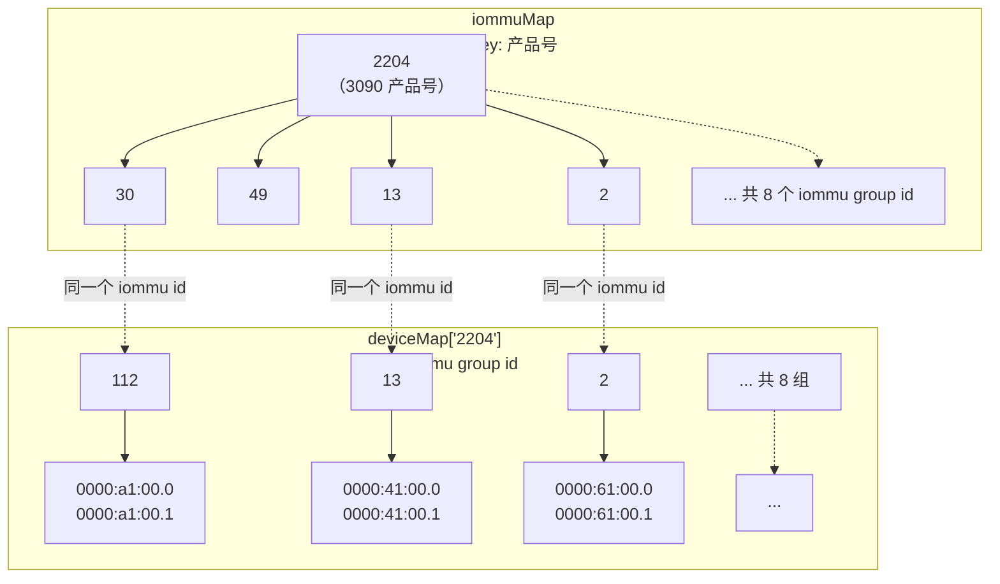

- iommuMap 记录"**产品号 → 该型号所有显卡的 iommu group id 列表**"，它回答的是"这台机器上有哪些型号、每种型号各几块"
- deviceMap 记录"**产品号 → iommu group id → PCI 地址列表**"，它回答的是"每个 iommu group 里具体有哪些 PCI 设备"（每块 3090 对应两个 PCI function：`.0` 是显卡本体，`.1` 是显卡上的音频设备）
- 可见 iommuMap 只是 deviceMap 的"顶层索引"，真正参与创建 device plugin 的是 deviceMap——外层循环取产品号（2204 → deviceName），内层循环把该型号下所有 iommu group 的设备摊平成 device 列表。iommuMap 本身在这个函数里只被打印日志，`iommuNodeMap`（被注释掉的那行）才是后续建立 iommu→NUMA 关系的关键。

- 这样的话，对 deviceMap 的循环就比较好理解了：它会为每组相同 deviceName 的 device 生成一个 gRPC 程序。该程序有两个功能：
  - 作为客户端，不断向 kubelet 上报自己的 GPU 信息，包括 unhealthy 的 GPU（但对于 vfio 驱动的 GPU 来说，unhealthy 没有什么意义）
  - 作为服务端，实现 Allocate 接口，等待 kubelet 的 Allocate 调用

#### 1.4.1.2. 上报的 Device 信息

> **ℹ️ 本节是我们的手工修改方案**：Device ID = iommu group id，环境变量包含整组设备地址（GPU+声卡），第 2 章的 KubeVirt 修改依赖此行为。曾评估切换到上游新版（Device ID 改为 PCI BDF、原生 NUMA topology 上报、env 只报请求设备自己的 BDF），与第 2 章不兼容，故暂不切换，两套方案的合并见第 2 章的整理。

在上一小节的循环中可以看到，程序使用 deviceMap 生成了一个新的包含多个 Device 对象的 devs 变量。而从上面的 proto 定义可以看到，Device 中是有 Topology 字段的，Topology 中也包含 Nodes 信息。

```go
type Device struct {
    // A unique ID assigned by the device plugin used
    // to identify devices during the communication
    // Max length of this field is 63 characters
    ID string `protobuf:"bytes,1,opt,name=ID,proto3" json:"ID,omitempty"`
    // Health of the device, can be healthy or unhealthy, see constants.go
    Health string `protobuf:"bytes,2,opt,name=health,proto3" json:"health,omitempty"`
    // Topology for device
    Topology             *TopologyInfo `protobuf:"bytes,3,opt,name=topology,proto3" json:"topology,omitempty"`
    XXX_NoUnkeyedLiteral struct{}      `json:"-"`
    XXX_sizecache        int32         `json:"-"`
}

type TopologyInfo struct {
    Nodes                []*NUMANode `protobuf:"bytes,1,rep,name=nodes,proto3" json:"nodes,omitempty"`
    XXX_NoUnkeyedLiteral struct{}    `json:"-"`
    XXX_sizecache        int32       `json:"-"`
}

type NUMANode struct {
    ID                   int64    `protobuf:"varint,1,opt,name=ID,proto3" json:"ID,omitempty"`
    XXX_NoUnkeyedLiteral struct{} `json:"-"`
    XXX_sizecache        int32    `json:"-"`
}
```

我们需要修改源码，让它把这个 node 信息上传上去。

---

首先，我们需要定义一个 iommuNodeMap，在 createIommuDeviceMap 方法中同时也为它赋值，最终它会形成如下的对应关系（具体代码这里不贴出）：

```go
// 从 PCI 设备路径中读取 numa_node，如 /sys/bus/pci/devices/0000:a1:00.0/numa_node
// node, err := readNumaFromFile(basePath, info.Name(), "numa_node")
// 将其填入 map 字典中。同一组里的显卡和声卡（如 0000:a1:00.0 与 0000:a1:00.1）
// 的 node 一定相同，map 天然具有去重功能。
// iommuNodeMap[iommuGroup] = node
// 最后形成这样一个对应关系表
// iommuNodeMap={49:0, 2:1, ....}
```

---
修改 devs 的构造代码：

```go
// 修改前
for _, dev := range v {
    devs = append(devs, &pluginapi.Device{
        ID:     dev,
        Health: pluginapi.Healthy,
    })
}

// 修改后
for _, dev := range v {
    pluginDevice := &pluginapi.Device{
        ID:     dev,
        Health: pluginapi.Healthy,
    }
    node, exist := iommuNodeMap[dev]
    if exist {
        nodeID, _ := strconv.ParseInt(node, 10, 64)
        pluginDevice.Topology = &pluginapi.TopologyInfo{
            Nodes: []*pluginapi.NUMANode{
                {
                    ID: nodeID,
                },
            },
        }
    }
    devs = append(devs, pluginDevice)
}
```

编译 main.go，然后将其覆盖到 container 镜像中。服务器端删除原有镜像并删除运行中的 daemon，达到重启的目的。

#### 1.4.1.3. 测试结果

从目前的测试来看，topology 已经生效，Pod 中的 cpuset 和 PCI 设备已经对应起来。但虚拟机方面仍然没有对应上。这个问题我们在 OpenStack 上也遇到过，当时是通过修改 nova-compute 的源码解决的；看来这里也需要修改 KubeVirt 的源码来解决（具体方案见第 2 章）。

修改后的设备上报时序如下（与 [2.2.1.2. NUMA 节点的上报](#2212-numa-节点的上报) 中的图一致，标注"1.4 修改"的为变化点）：

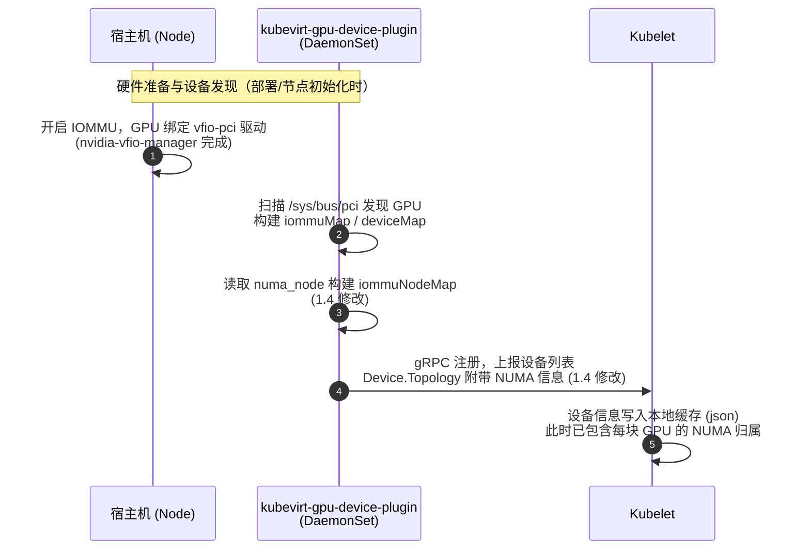

### 1.4.2. containerd-runc

从目前来看，containerd-runc 模式下可以正常进行 NUMA 匹配，只需要和 vm-passthrough（见 1.4.1）进行一样的配置即可。

示例 Pod 设置：

```yaml
apiVersion: v1
kind: Pod
metadata:
  name: gpu-pod
spec:
  containers:
    - name: gpu-container
      image: nvidia/cuda:12.0.0-base-ubuntu20.04
      command: ["sleep", "infinity"]
      resources:
        limits:
          nvidia.com/gpu: 2
          cpu: 22
          memory: 16Gi
        requests:
          nvidia.com/gpu: 2
          cpu: 22
          memory: 16Gi
  restartPolicy: Always
```

## 1.5. 内存分配


### 1.5.1. 不使用 static 模式

参考文档：[Memory Manager](https://kubernetes.io/docs/tasks/administer-cluster/memory-manager)

问题 1：内存有单独的 NUMA 匹配机制。如果开启了 CPU static 分配而不开启 memory static 分配，就会产生一些问题，最大的可能是内存溢出，导致 OOM kill 的产生。

问题 2：但开启后也会产生问题。每个子 manager 都会有自己的 Hints 算法，memory 也会有自己的一套（源码解读见 1.3.2.3.3），其结果可能与 cpuManager 选出的 NUMA 集不一致，导致 Merge 失败。

这里我们只讨论 Pod 级别的分配。


不使用 static 模式会产生什么？

参考文档 <https://zhuanlan.zhihu.com/p/554397630>

在不使用 static 模式的情况下，会由操作系统采用就近分配的形式来解决。这种情况在本节点内存充足时还是可以的，经过测试没有出现 remote 分配的情况。

### 1.5.2. 为什么会 OOM kill

这个章节有点莫名其妙，但好像来源是我们stress测试时，Pod 被 OOM kill 了。我们当时的疑问是：为什么会被ook kill？我们给 Pod 分配了 16G 内存，为什么会被 OOM kill？

答：超出内存的限制了。（废话）

是我们把 stress 用错了，参数组合错误导致超出给 Pod 分配的内存。但为什么 Pod 会发生 OOM kill 呢？通常我们认为一个 Pod 内的进程内存超出，不应该杀 Pod，而应该杀进程才对。

<https://izsk.me/2023/02/09/Kubernetes-Out-Of-Memory-1/>  <https://blog.csdn.net/ygq13572549874/article/details/144357185>  <https://kubernetes.io/zh-cn/docs/tasks/configure-pod-container/assign-memory-resource/>

通过上面的文章，我们可以大致得出以下的解释：

- 每个 Pod 都会有自己单独的 cgroup 组，而 cgroup 组本身没有 OOM kill 的能力，得依赖于操作系统
- 当 cgroup 组整体超过其设置的 limit 时，内核首先会尝试从 cgroup 内部回收内存；如果回收不成功，将调用 OOM killer 来选择（打分）并终止 cgroup 内最庞大的任务
- 一旦 cgroup 组突破了 limit，OOM killer 一定会选择一个进程 kill 掉，但被 kill 掉的进程不一定是我们认为的最有可能被 kill 的那个

我们来看一下我们的系统日志：

```
[Tue Mar 11 10:16:36 2025] oom-kill:constraint=CONSTRAINT_MEMCG,nodemask=(null),cpuset=cri-containerd-85d3a7f5db9b92df4f5930b5bf062cff540084aacfc05310acc6c5cc963023ad.scope,mems_allowed=0-7,oom_memcg=/kubepods.slice/kubepods-podf9411888_a753_41f4_9520_afc45712f5b5.slice,task_memcg=/kubepods.slice/kubepods-podf9411888_a753_41f4_9520_afc45712f5b5.slice/cri-containerd-85d3a7f5db9b92df4f5930b5bf062cff540084aacfc05310acc6c5cc963023ad.scope,task=stress,pid=3804874,uid=0
[Tue Mar 11 10:16:36 2025] Memory cgroup out of memory: Killed process 3804874 (stress) total-vm:13632272kB, anon-rss:1489488kB, file-rss:264kB, shmem-rss:0kB, UID:0 pgtables:2956kB oom_score_adj:-997
[Tue Mar 11 10:16:36 2025] Tasks in /kubepods.slice/kubepods-podf9411888_a753_41f4_9520_afc45712f5b5.slice/cri-containerd-85d3a7f5db9b92df4f5930b5bf062cff540084aacfc05310acc6c5cc963023ad.scope are going to be killed due to memory.oom.group set
[Tue Mar 11 10:16:36 2025] Memory cgroup out of memory: Killed process 3803554 (sleep) total-vm:1572kB, anon-rss:4kB, file-rss:0kB, shmem-rss:0kB, UID:0 pgtables:32kB oom_score_adj:-997
[Tue Mar 11 10:16:36 2025] Memory cgroup out of memory: Killed process 3803846 (bash) total-vm:2416kB, anon-rss:436kB, file-rss:1632kB, shmem-rss:0kB, UID:0 pgtables:44kB oom_score_adj:-997
[Tue Mar 11 10:16:36 2025] Memory cgroup out of memory: Killed process 3804873 (stress) total-vm:13632272kB, anon-rss:1258752kB, file-rss:264kB, shmem-rss:0kB, UID:0 pgtables:2508kB oom_score_adj:-997
[Tue Mar 11 10:16:36 2025] Memory cgroup out of memory: Killed process 3804874 (stress) total-vm:13632272kB, anon-rss:1489488kB, file-rss:264kB, shmem-rss:0kB, UID:0 pgtables:2956kB oom_score_adj:-997
[Tue Mar 11 10:16:36 2025] Memory cgroup out of memory: Killed process 3804875 (stress) total-vm:13632272kB, anon-rss:992376kB, file-rss:264kB, shmem-rss:0kB, UID:0 pgtables:1984kB oom_score_adj:-997
[Tue Mar 11 10:16:36 2025] Memory cgroup out of memory: Killed process 3804876 (stress) total-vm:13632272kB, anon-rss:896808kB, file-rss:264kB, shmem-rss:0kB, UID:0 pgtables:1796kB oom_score_adj:-997
[Tue Mar 11 10:16:36 2025] Memory cgroup out of memory: OOM victim 3804877 (stress) is already exiting. Skip killing the task
[Tue Mar 11 10:16:36 2025] Memory cgroup out of memory: OOM victim 3804878 (stress) is already exiting. Skip killing the task
[Tue Mar 11 10:16:36 2025] Memory cgroup out of memory: Killed process 3804879 (stress) total-vm:13632272kB, anon-rss:1162128kB, file-rss:264kB, shmem-rss:0kB, UID:0 pgtables:2320kB oom_score_adj:-997
[Tue Mar 11 10:16:36 2025] Memory cgroup out of memory: Killed process 3804880 (stress) total-vm:13632272kB, anon-rss:1112496kB, file-rss:264kB, shmem-rss:0kB, UID:0 pgtables:2220kB oom_score_adj:-997
[Tue Mar 11 10:16:36 2025] Memory cgroup out of memory: Killed process 3804881 (stress) total-vm:13632272kB, anon-rss:1034616kB, file-rss:264kB, shmem-rss:0kB, UID:0 pgtables:2068kB oom_score_adj:-997
[Tue Mar 11 10:16:36 2025] Memory cgroup out of memory: OOM victim 3804882 (stress) is already exiting. Skip killing the task
[Tue Mar 11 10:16:36 2025] Memory cgroup out of memory: Killed process 3804883 (stress) total-vm:13632272kB, anon-rss:1034352kB, file-rss:264kB, shmem-rss:0kB, UID:0 pgtables:2068kB oom_score_adj:-997
[Tue Mar 11 10:16:36 2025] Memory cgroup out of memory: OOM victim 3804884 (stress) is already exiting. Skip killing the task
[Tue Mar 11 10:16:36 2025] Memory cgroup out of memory: OOM victim 3804885 (stress) is already exiting. Skip killing the task
[Tue Mar 11 10:16:36 2025] Memory cgroup out of memory: OOM victim 3804886 (stress) is already exiting. Skip killing the task
[Tue Mar 11 10:16:36 2025] Memory cgroup out of memory: OOM victim 3804887 (stress) is already exiting. Skip killing the task
```

从日志中我们会发现一个问题：OOM killer 会计算 Pod 中各个进程的 score 值来决定谁会被杀掉，但 OOM killer 也有些傻。我们说系统的 OOM killer 是绝对不会杀死进程 1 的，但 cgroup 中的进程可不是这样的。对系统的 OOM killer 来说，它看到的 cgroup 中的 pid 都是系统内的 id。也就是说，cgroup 中 pid 为 1 的进程在系统内可能是另一个进程号。比如我们的 sleep 进程在我们的 cgroup 中是进程 1，但在系统内是 3803554。

OOM killer 另一个傻的地方是：它只算分数和 pid 号，不算内存的实际使用情况，根据 pid 号"排头砍去"，所以导致了我们的 sleep 进程被杀，进而导致整个 Pod 被杀掉。

所以说 to kill or not to kill，这是一个问题：

- 如果一个 Pod 不做限制，就算它独占一整个节点，也有可能将整个节点跑死
- 做了限制，那么它就有被 kill 的风险
- 给它提高 score 呢？做限制的同时再给整个 Pod 的 score 提高，会怎么样呢？

虽然参考文档里提供了下面这个示例，但我们没有在 kubelet 代码中找到 Pod 可以使用 oomScoreAdj 这样的参数，确实可以通过为当前 kubelet 设置达到全局效果。

```
apiVersion: v1
kind: Pod
metadata:
  name: mypod
spec:
  securityContext:
    oomScoreAdj: 500
  containers:
  - name: mycontainer
    image: myimage
```

#### Pod 中程序对 cgroup 的使用

<https://simplealgo.com/jvm-vs-pvm/>

高级语言都可以进行自动的内存管理（C++ 除外？），做 AI 的主流语言 Python 和 Java 都有自动的内存回收策略，正常情况下是不会发生 OOM kill 问题的。而我们测试用的 stress 是 C 语言写的，所以能把内存挤爆。

### 1.5.3. KubeVirt 的内存匹配

参考文档：<https://blog.csdn.net/NUCEMLS/article/details/131797992>

KubeVirt 在使用 NUMA 的情况下，会强行使用大页内存。这个不清楚是机制问题还是别的什么原因。并且如上面的文档所述，需要注意 KubeVirt 为 Pod 本身保留内存的问题：因为大页都给虚拟机用了，但 Pod 本身仍然是需要内存的，这种情况需要考虑内存保留，但问题不大。

#### 1.5.3.1. hugePages

大页内存可以大幅提升内存性能，减少 TLB miss 的发生。KubeVirt 在使用 NUMA 的情况下，会强行使用大页内存。

#### 1.5.3.2. 另一种思路：干脆不让 memoryManager 参与（memoryManagerPolicy=None）

上面 1.3.2.3.3（memoryManager 的 calculateHints）提到过一个问题：如果 cpuManager 给出的 bestHint 是跨 node 的（如 {0,1}），而 memoryManager 的 static 策略倾向于单 node（如 {0}），两者 Merge 就会失败，Pod 被 restricted 策略拒绝。这个问题有一种釜底抽薪的解法：**memoryManagerPolicy 设为 None，让内存不参与 TopologyHints**。

源码依据（`pkg/kubelet/cm/memorymanager/policy_none.go`）：

```go
func (p *none) GetPodTopologyHints(...) map[string][]topologymanager.TopologyHint {
    return nil
}
```

None 策略直接返回 `nil`。而 topologyManager 的 Merge 只对**提供了 hints 的资源**求交集——memory 不出声，bestHint 就完全由 CPU 和 Device 两家决定，`restricted` 策略照样工作。制造分歧的第三方退场了，分歧自然消失。

这时的配置形态：

```yaml
cpuManagerPolicy: static
memoryManagerPolicy: None        # 关键差异
topologyManagerPolicy: restricted
```

为什么这在 KubeVirt 场景下是成立的？可以类比 OpenStack 的 flavor 机制：flavor 把 vCPU 和内存按固定比例打包进 NUMA cell，怎么组合都正好放下，并不需要一个独立的"内存对齐器"。我们的场景等价于：

1. **QEMU 的 vCPU 线程被钉死**：KubeVirt `dedicatedCPUPlacement` + cpuManager static，vCPU 线程跑在哪个 node，就被绑在哪个 node
2. **内存用 first-touch 就近分配**：QEMU 为虚拟机分配内存（大页）的动作由这些**已钉死**的线程执行，内核的 first-touch 策略天然把页落在本地 node——这正是 1.5.1 实测"没有出现 remote 分配"的原因
3. 结果：内存虽然没有经过 memoryManager 的"计划分配"，但**实际物理落点与 CPU 一致**，达到了和 static 内存策略同样的效果

也就是说：**static 内存策略是"先规划再分配"，这个方案是"靠 CPU 钉死 + 内核就近分配事后保证"**。对虚拟机这种全独占、全钉死的负载，两者殊途同归。

需要留意（aware）的代价：

- **内存不设防**：memoryManager static 还兼任"每 node 内存账本"（machineState），没有它，同一 node 上的内存溢出风险不再被 kubelet 预判——不过我们的场景是每 VM 独占节点资源，问题不大
- **依赖内核行为**：first-touch 是"通常正确"而不是"契约保证"，极端情况（目标 node 大页碎片化、分配时本地不足）内核会跨 node 拿页，且不会有任何告警
- **virt-launcher 自身的内存**没有 NUMA 语义（不过 static 策略本来就只管 Pod 主容器的资源）

## 1.6. CPU 分配

### 1.6.1. CPU 均匀的分配

参考文档：<https://kubernetes.io/zh-cn/blog/2024/08/22/cpumanager-static-policy-distributed-cpu-across-cores/>

在 k3s 中应该做如下配置：

```yaml
kubelet-arg:
- runtime-request-timeout=15m
- container-log-max-files=3
- container-log-max-size=10Mi
# cpu 支持静态分配
- cpu-manager-policy=static
# cpu 与 numa 严格约束
- topology-manager-policy=restricted
# 保留的 cpu
- reserved-cpus=0,6,12,18,24,30,36,42
# 为 k8s 开启 CPUManagerPolicyAlphaOptions 这个特性
- feature-gates=CPUManagerPolicyAlphaOptions=true
# 只有开启了 CPUManagerPolicyAlphaOptions 特性，本条才会生效。使得 cpu 可以均匀地分配到多个 numa 上
- cpu-manager-policy-options=distribute-cpus-across-numa=true
```

- q: 开启 distribute-cpus-across-numa 后 CPU 分配绝对均匀吗？
  - a: 当然不是。无论如何，11 个 CPU 也无法均分到两个 NUMA 节点上
- q: 那可以均匀分配后，是不是就可以考虑减少 reserved-cpus 了？
  - a: 是的。可以减少 reserved-cpus 的使用，留出更多的 CPU 资源分配给 Pod。但这并不绝对，还是需要综合考虑
- q: 还有什么？
  - a: cpuManager 和 topologyManager 其实也是 feature，只不过它们的重要性使得它们默认开启（ps：至少在 k3s 中是默认开启的）

## 1.7. 一些代码路径

### 1.7.1. features 配置

代码路径：`/kubernetes/pkg/features/kube_features.go`。通过追踪 CPUManagerPolicyAlphaOptions 这个 feature gate 的定义，我们找到了该文件，里面提供了一份相当全面的 feature 配置选项。

### 1.7.2. policy 配置

`distribute-cpus-across-numa` 是 CPUManagerPolicyAlphaOptions 下的一个 policy option，通常定义在每个 manager 的 `policy_options.go` 中，如 `/kubernetes/pkg/kubelet/cm/cpumanager/policy_options.go`。

## 1.8. 最后

### 1.8.1. kubelet 配置文件

最终我们在 k3s 中使用的 kubelet 配置汇总如下（其中注释掉的几行是 memory manager 相关配置，见 1.5，按需开启）：

```yaml
kubelet-arg:
- runtime-request-timeout=15m
- container-log-max-files=3
- container-log-max-size=10Mi
- cpu-manager-policy=static
- topology-manager-policy=restricted
- reserved-cpus=0,6,12,18,24,30,36,42
- feature-gates=CPUManagerPolicyAlphaOptions=true
- cpu-manager-policy-options=distribute-cpus-across-numa=true
  #- reserved-cpus=4
  #- memory-manager-policy=Static
  #- system-reserved=memory=4Gi
  #- kube-reserved=memory=4Gi
  #- reserved-memory=0:memory=1Gi;1:memory=1Gi;2:memory=1Gi;3:memory=1Gi;4:memory=1Gi;5:memory=1Gi;6:memory=1Gi;7:memory=1Gi
```

### 1.8.2. 节点模式切换

模式切换相对来说比较简单，只要设置一个节点使用 vfio 驱动还是 nvidia 驱动即可，在 kubelet 的配置上两者是一致的。当设置完成后，gpu-operator 会自动进行 daemonset 的转换。

### 1.8.3. 大页设置

KubeVirt 需要大页而 Pod 不需要大页。我们可以参考 gpu-operator 的操作，在模式切换时进行大页的初始化或删除。如果我们使用2M大页，则可以在运行时动态分配和删除；如果使用1G大页，则必须在内核启动参数中预留，且不支持热切换。

两种规格的详细区别：

| 维度 | 2M 大页 (hugepages-2Mi) | 1G 大页 (hugepages-1Gi) |
|---|---|---|
| TLB 覆盖效率 | 是 4KB 页的 512 倍 | 是 4KB 页的 26 万倍，页表翻译只走 1 级 |
| 预留方式 | 运行时可动态分配（`sysctl -w vm.nr_hugepages=N`），**支持热切换**，可配合模式切换脚本随时初始化/删除 | 基本必须在内核启动参数中预留（`default_hugepagesz=1G hugepagesz=1G hugepages=N`），**不支持热切换**，运行时几乎无法分配出连续 1G 物理内存 |
| 碎片要求 | 需要 2M 连续物理页，系统运行一段时间后也较容易凑出 | 需要 1G 物理连续内存，系统跑久后基本不可能动态分出 |
| 灵活性 | 粒度细，按 2M 取整，浪费少 | 粒度粗，虚拟机内存不是 1G 整数倍时浪费大，小 VM 用不了 |
| k8s 资源名 | `hugepages-2Mi` | `hugepages-1Gi` |
| 典型场景 | 数据库、一般性能敏感应用、中小虚拟机 | 超大内存虚拟机（数百 GB）、HPC/AI 训练 |

对我们的 GPU 虚拟机场景，结论是**选 2M**：因为大页需要随 vm-passthrough / container 模式切换而动态初始化/删除，只有 2M 支持热切换；KubeVirt 的 hugepages 默认也是 2Mi，粒度细、VMI 内存配置灵活。1G 仅适合单台虚拟机内存很大（如 200G+）、且节点可以接受重启改内核参数静态预留的场景，与我们模式切换的运维方式冲突。

另注意：大页一旦预留，这部分内存就从普通可分配池里扣掉了（这也是 1.5.3 中"KubeVirt 强行使用大页后要给 Pod 本身保留内存"的根源），1G 大页粒度粗，这种占用会更容易造成浪费。

# 2. KubeVirt 使用 NUMA 映射

目标：当前 KubeVirt 是没有使用 NUMA 映射的。这一点我们在 OpenStack 中通过定制开发做到了，现在需要让 KubeVirt 也实现同样的能力。

注：第 1 章的修改只是让设备上报 NUMA 信息、kubelet 能按 NUMA 匹配选中设备（Pod 层面已生效），但虚拟机层面还无法使用。本章讲的是我们如何让 KubeVirt（虚拟机）也用上这些 NUMA 信息。

## 2.1. 简介

### 2.1.1. device-plugin

先澄清一个容易混淆的点——环境里其实存在两套 device-plugin，我们的修改对象是后者：

- **KubeVirt 自带的**：KubeVirt 社区的 generic-device-plugins，也能支持 PCI 设备的发现，但处理起来确实很麻烦：使用它时需要我们手动进行 vfio 驱动的处理，很不方便
- **我们实际使用的**：nvidia 为 KubeVirt 场景开发的 **kubevirt-gpu-device-plugin**（golang 工程），随 gpu-operator 部署。第 1 章和本章修改的都是它

所以我们切换为 nvidia 的 gpu-operator 及其 device-plugins，这一切就变得方便多了。下面我们就简单了解下 nvidia 的 gpu-operator 对 PCI 的处理。

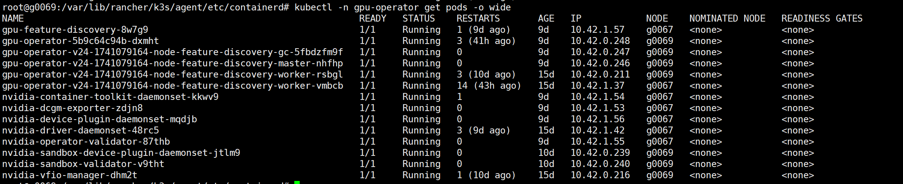

对于 pci_passthrough 模式的虚拟机，主要由以下两个 pod 来进行设备的管理和设备驱动：

---

**nvidia-sandbox-device-plugin-daemonset**：设备管理。

容器内运行的就是 nvidia 开发的 kubevirt-gpu-device-plugin 这个 golang 工程（第 1 章修改的就是它），该工程提供了对 vfio 驱动的 PCI 显卡的发现、健康上报及分配。后续我们会让它在分配时添加一个 pod env，来进行 Pod 级别的 NUMA 分配。

---

**nvidia-vfio-manager**：vfio 驱动管理。

该容器包含了 vfio 的初始化/卸载脚本。当容器被启动时，它会进行 nvidia 设备的 vfio 驱动初始化；当容器被删除时，它会进行 vfio 驱动的卸载。

---

这两个 pod 就简单地构成了虚拟机使用 pci_passthrough 设备的管理。并且 gpu-operator 会监控节点的 `nvidia.com/gpu.workload.config` label 定义，自动在 vm-passthrough 模式和 container 模式之间进行切换。

### 2.1.2. kubevirt

KubeVirt 是一个标准的 K8s 应用，而不是一个"基于 K8s 运行的应用"，两者还是有区别的。

KubeVirt 包含以下几个组件：

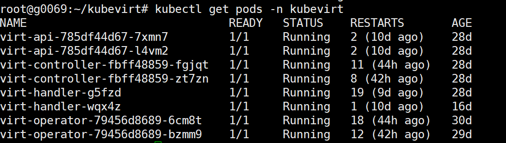

---

**api**：非必要。

我们说 KubeVirt 是一个符合 K8s 标准的应用，但 api 并不是必须的。该 api 的作用就是帮助我们也能通过 api 来定义 KubeVirt 的资源，相当于一个中间件。

**controller**：KubeVirt 的核心组件。

简单来说，所有 K8s 的 controller 组件都会实现一个 watch 机制，来监控资源的变化，然后处理这些资源。KubeVirt 的 controller 也是如此：它监控相关的 CRD 资源，如果有资源变化，它就去做相应的处理。

**handler**：运行在每个节点上。

这个 handler 组件负责虚拟机生命周期的管理，类似于 nova-compute 的存在。但实际上 virt-handler 将一部分的功能交由了 virt-launcher 来进行，它们两个组合起来才像一个真正的 nova-compute。

**operator**：部署与生命周期管理。

virt-operator 是一个关键组件，负责管理和维护 KubeVirt 的部署和生命周期。它的主要作用是确保 KubeVirt 组件的正确安装、升级和运行。

**launcher**：虚拟机的宿主 pod。

virt-launcher pod 在虚拟机启动后会生成，虚拟机会在这个 pod 中运行，并且使用 pod 的资源。virt-launcher pod 中会有几个运行程序：virt-launcher-monitor、virt-launcher、virtqemud、virtlogd、qemu-kvm。

## 2.2. 修改

在第 1 章中，我们对 device-plugin 进行了修改，使其能够上报 PCI 设备的 NUMA 信息，并且可以在 kubelet 进行 NUMA 匹配时被选中。

但仅有这些还不够，虚拟机侧仍然有问题需要解决。本章的修改按功能拆解为三个问题（涉及 nvidia 的 kubevirt-gpu-device-plugin 与 KubeVirt 本身两个项目，均需重新构建镜像部署）：

- **显卡与声卡的共存**（见 2.2.2）：一块消费级 GPU 在 PCI 上是显卡+声卡两个 function，vfio 直通时声卡必须跟随显卡一起进入虚拟机。修改 KubeVirt
- **显卡的分配与 NUMA 信息的传递**（见 2.2.3）：device-plugin 的 allocate 把每块 GPU 的 NUMA 归属以环境变量的形式传给 Pod。修改 kubevirt-gpu-device-plugin
- **NUMA 信息传递的使用**（见 2.2.4）：KubeVirt 读取该环境变量，在生成 libvirt XML 时把 GPU（连同声卡）挂载到对应 NUMA 节点的 PCIe 总线上。修改 KubeVirt

### 2.2.1. 流程

从各组件交互的时序来看，完整生命周期（含部署期的硬件准备）如下：

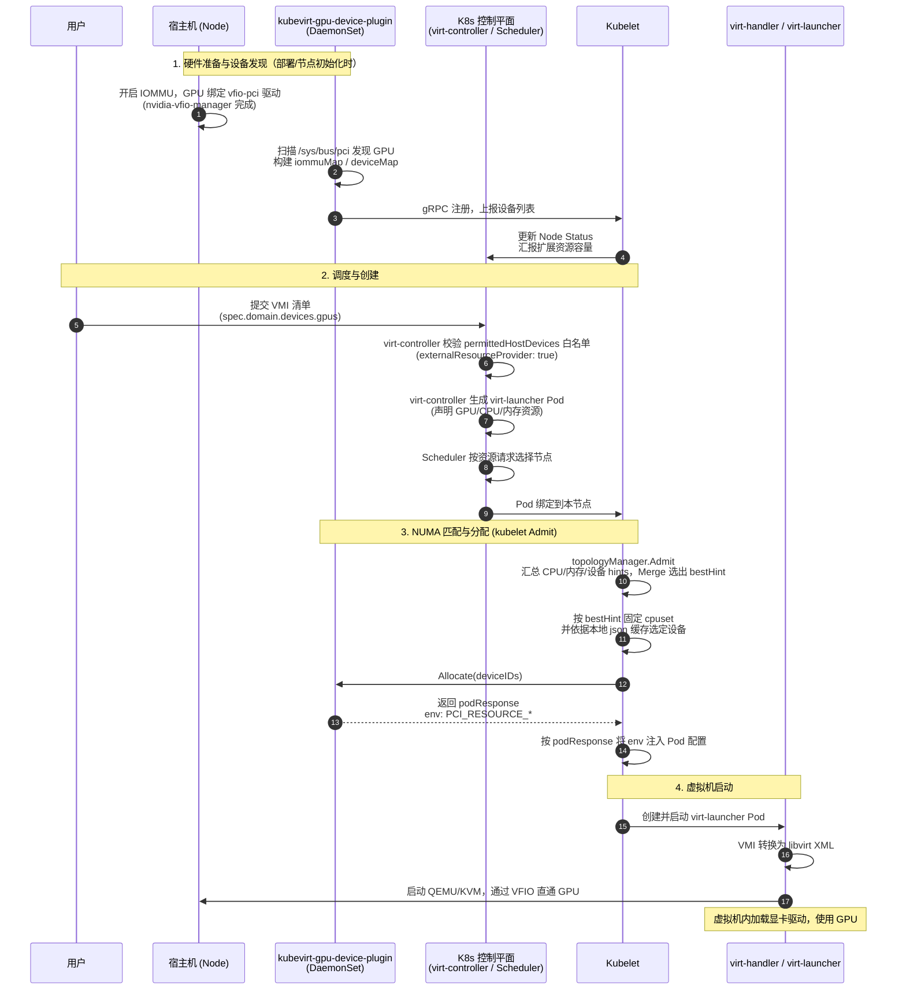

原始流程图（手绘，供对照）：

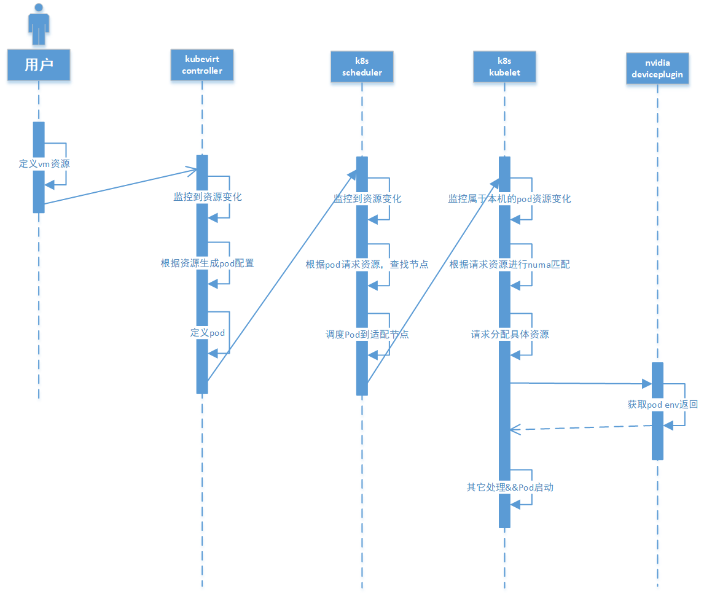

从流程图可以看到，KubeVirt controller 仅仅是生成了一个利用了相关资源的 Pod，将 Pod 交由 K8s 具体处理。而 K8s 会根据请求的资源找到合适的节点。然后 kubelet 也算是一个 controller 的实现，它会监控调度到本节点的 Pod，根据 Pod 的请求进行资源的 NUMA 匹配，匹配完成后去请求各个 plugin（或者没有）分配资源。

注意：

- devicePlugin 启动后通过 gRPC 注册，并以 ListAndWatch 持续上报设备信息（含健康状态）；kubelet 在内存中维护一份设备缓存，并把分配状态持久化到本地 json 文件（kubelet_internal_checkpoint）
- kubelet 在分配时不会实时请求 devicePlugin，而是根据内存中的设备缓存来进行 NUMA 匹配和分配；json 文件用于 kubelet 重启后恢复已分配的设备状态
- kubelet 在分配完成后，会调用 devicePlugin 的 allocate 函数来进行"分配"
- 在 kubevirt-gpu-device-plugin 中，它的 allocate 会返回一个包含 pci_ids 的 env，并将其封装在 podResponse 中
- kubelet 在接收到 podResponse 的返回后，会根据 podResponse 来对当前的 pod 配置进行修改
- 修改完成后 pod 继续进行，直至 pod 生成

#### 2.2.1.1. Pod 生成后

我们说 K8s 的资源基于 Pod，虚拟机也不例外：虚拟机在 Pod 中，使用 Pod 所限制的资源。

一个 Pod 对应一个虚拟机，而 Pod 更像是一个虚拟机容器，容器中其实只有虚拟机的监视器和 console 程序。具体虚拟机的启动是由 virt-handler 来完成的。

#### 2.2.1.2. NUMA 节点的上报

注意：上图的时序是原始机制——device-plugin 上报设备时不包含 NUMA 信息，kubelet 的 NUMA 匹配只覆盖 CPU 和内存，deviceManager 无法为 GPU 生成拓扑 hint（见 1.3.2.3.2 的分析）。

我们在 [1.4.1. pci-passthrough 的调整](#141-pci-passthrough) 中修改了 kubevirt-gpu-device-plugin：扫描 PCI 设备时读取 numa_node、构建 iommuNodeMap，并在 gRPC 注册上报设备列表时通过 `Device.Topology` 附带 NUMA 信息。叠加 1.4 的调整后，设备上报阶段的时序如下（本图只关注上报，后续的调度与创建、NUMA 匹配见上图；标注"1.4 修改"的为变化点）：


上报完成后，下游的效果：kubelet 的设备缓存（本地 json）已记录每块 GPU 的 NUMA 归属，Admit 阶段的设备 hints 可以正常生成，Merge 之后 filterByAffinity 会优先选择与 bestHint 对齐的 GPU——最终 Pod 的 cpuset 与分配到的 PCI 设备落在同一 NUMA 节点（见 1.4.1.3 的测试结果）。

但虚拟机侧仍未生效：virt-launcher 转换 libvirt XML 时不感知 NUMA，GPU 直通挂载的 PCIe 总线也没有 numaNode 属性。这正是 2.2.3 和 2.2.4 要解决的问题。

### 2.2.2. 显卡与声卡的共存

（本节修改 KubeVirt 本身的源码，涉及 schema.go 与 hostdev.go。）

#### 2.2.2.1. 问题

一块消费级 GPU（如 3090）在 PCI 总线上是两个 function：

- `0000:a1:00.0`：显卡本体
- `0000:a1:00.1`：HDMI 音频（声卡）

vfio 直通以 iommu group 为单位，这两个 function 同属一个 group，必须一起进入虚拟机。但用户在 VMI 中只按 GPU 声明资源（spec.domain.devices.gpus），并不会单独声明声卡，声卡只能"搭便车"跟随显卡。

device-plugin 侧天然支持这一点：deviceMap 中每个 iommu group 记录的就是两个 function 的地址（见 1.4.1 的 deviceMap 结构），allocate 返回的 PCI_RESOURCE 环境变量里，每块 GPU 自带它的声卡地址。也就是说，环境变量中的地址数量是 VMI 声明 GPU 数量的 2 倍。

问题出在 KubeVirt 侧：原始的 CreateHostDevices 按 VMI 声明的 GPU 数量逐个 Pop 地址，每个地址生成一个彼此独立的顶层 hostdev。这样显卡和声卡会被当成两个毫不相干的设备：既不能保证配对，也无法挂到同一个 PCIe 控制器的 function 0/1 上，与宿主机的 PCI 拓扑不一致。

#### 2.2.2.2. 修改：auxFlag 判断与 SubDevice 挂载

完整代码见 2.2.4.3 的 createHostDevices，这里只摘出共存相关的部分：

```go
for resourceName, hostDevicesData := range newHostDevicesMetaData {
    // bool of aux device for consumer's cards
    var auxFlag bool
    // count resource request
    reqLen, _ := addrPool.RLen(resourceName)

    // 如果 pool 中的地址数不等于声明的 GPU 数量，
    // 且恰好是它的 2 倍，说明每块显卡带一个附属设备（声卡）
    if len(newHostDevicesMetaData[resourceName]) != reqLen {
        if 2*len(newHostDevicesMetaData[resourceName]) == reqLen {
            auxFlag = true
        }
    }

    for _, hostDeviceData := range hostDevicesData {
        var auxAddress string
        auxHostDevice := &api.HostDevice{}
        // 第一次 Pop：显卡地址（NUMA 解析见 2.2.4）
        address, err := addrPool.Pop(hostDeviceData.ResourceName)
        // ...
        if auxFlag {
            // 第二次 Pop：紧随其后的声卡地址
            auxAddress, err = addrPool.Pop(hostDeviceData.ResourceName)
            // ...
        }
        // ...
        hostDevice, err := createHostDev(hostDeviceData, address)
        // ...
        if auxAddress != "" {
            auxHostDevice, err = createHostDev(hostDeviceData, auxAddress)
            // ...
        }
        // ...
        // 声卡不再追加为独立的顶层设备，而是挂为显卡的子设备
        if auxHostDevice != nil {
            hostDevice.SubDevice = append(hostDevice.SubDevice, *auxHostDevice)
        }
        // ...
    }
}
```


为此在 schema.go 的 HostDevice 结构体中增加了 SubDevice 字段：

```go
type HostDevice struct {
    XMLName    xml.Name         `xml:"hostdev"`
    Source     HostDeviceSource `xml:"source"`
    Type       string           `xml:"type,attr"`
    BootOrder  *BootOrder       `xml:"boot,omitempty"`
    Managed    string           `xml:"managed,attr,omitempty"`
    Mode       string           `xml:"mode,attr,omitempty"`
    Model      string           `xml:"model,attr,omitempty"`
    Address    *Address         `xml:"address,omitempty"`
    Alias      *Alias           `xml:"alias,omitempty"`
    Display    string           `xml:"display,attr,omitempty"`
    RamFB      string           `xml:"ramfb,attr,omitempty"`
    Controller []Controller     `xml:"controller,omitempty"`
    SubDevice  []HostDevice     `xml:"subdevice,omitempty"`
}
```

要点：

- auxFlag：地址数是声明 GPU 数量的 2 倍时，判定每块显卡带附属声卡。**实际上，上面我们也犯一个错误：没有考虑到掉卡的问题，而是单纯的看位数，当我们手动移除了一个显卡时，声卡是不会随之移除的，这里我们需要整理避免这个bug的产生。**
- 成对 Pop：先显卡后声卡。device-plugin 在 assemble env 时同一块卡的两个 function 是连续追加的，因此紧邻的两次 Pop 天然配对
- SubDevice：声卡的 hostdev 挂为显卡 hostdev 的子设备，而不是独立顶层设备
- 挂载时两者共享同一个 pxb-pcie 控制器：显卡 multifunction=on、function=0，声卡 function=1（见 2.2.4.3 的 attachHostDeviceToController 调用），与宿主机 PCI 拓扑一致
- 显卡与声卡同在一个 iommu group，numa_node 一定相同（见 1.4.1 的 iommuNodeMap），因此两者共用同一个带 numaNode 属性的控制器不会有歧义

### 2.2.3. 显卡的分配与 NUMA 信息的传递（kubevirt-gpu-device-plugin）

（本节修改 nvidia 开发的 kubevirt-gpu-device-plugin，改完只需更新 device-plugin 的容器镜像。）

从流程图中可以看到，kubelet 会在 NUMA 匹配完成后去请求各个资源的分配。具体到 kubevirt-gpu-device-plugin（即 nvidia 的 device-plugin），这里就是调用 allocate 方法。

注意：这里的"上报"与第 1 章的 topology 上报是**两件不同的事**（真正意义上的上报发生在 gRPC 注册阶段，即 2.2.1.2 与 1.4 描述的 Device.Topology 上报），这里是分配环节的伴随动作，容易混淆，对比一下：

| | 1.4 / 2.2.1.2 的 topology 上报 | 2.2.3 的 NUMA 信息传递 |
|---|---|---|
| 发生时机 | 插件启动时的 gRPC 注册阶段（ListAndWatch） | Pod 调度完成后 kubelet 调用 Allocate 时 |
| 数据通路 | 插件 → kubelet（Device.Topology 字段） | 插件 → Pod 环境变量（ContainerAllocateResponse.Envs） |
| 作用对象 | kubelet 自己用 | 虚拟化层（virt-launcher）用 |
| 起什么作用 | 供 kubelet 在 Admit 阶段生成 hints、做 NUMA 对齐决策，选出"对"的设备 | 把选出来的设备**已确定的** NUMA 归属告知 KubeVirt，供其生成带 numaNode 的 libvirt XML |
| 数据形态 | 结构化（NUMANode.ID） | 字符串拼接（`addr/nodeID`） |

简言之：上报决定"选哪块卡"（kubelet 层面的对齐决策），本节是"告诉虚拟机这块卡在哪个 node"（结果传递）。前者是决策的输入，后者是决策结果向下的转发。

#### 2.2.3.1. allocate（第一版）

```go
func (dpi *GenericDevicePlugin) Allocate(ctx context.Context, reqs *pluginapi.AllocateRequest) (*pluginapi.AllocateResponse, error) {
    log.Println("In allocate")
    // 生成一个空的response
    responses := pluginapi.AllocateResponse{}
    envList := map[string][]string{}
    //可以看到，allocate请求的结构体，
    /*
                ContainerRequests: []*v1beta1.ContainerAllocateRequest{
                    {
                        DevicesIDs: []string{"device1", "device2"},
                    },
                },
    */

    //循环请求
    for _, req := range reqs.ContainerRequests {
        deviceSpecs := make([]*pluginapi.DeviceSpec, 0)
        // 这里的请求其实不是具体的pci_id，而是一个pci所属的Iommu_id。相应的devicePlugin上报的也是iommu_id.
        for _, iommuId := range req.DevicesIDs {
            devAddrs := []string{}
            devNodeAddrsMap := map[string]string{}
            // 返回iommuMap
            returnedMap := returnIommuMap()
            //Retrieve the devices associated with a Iommu group
            // 根据iommu_id查找相应的dev
            nvDev := returnedMap[iommuId]

            // 循环查找到的pci_dev
            for _, dev := range nvDev {
                // 根据iommu来读取到iommu group,这个和接下来的判断一般不会出现问题，否则就重启下device_plugin
                iommuGroup, err := readLink(basePath, dev.addr, "iommu_group")
                if err != nil || iommuGroup != iommuId {
                    log.Println("IommuGroup has changed on the system ", dev.addr)
                    return nil, fmt.Errorf("invalid allocation request: unknown device: %s", dev.addr)
                }

                // 查看vendorID是否等于nvidia的10de,不是的话就跳过
                vendorID, err := readIDFromFile(basePath, dev.addr, "vendor")
                if err != nil || vendorID != "10de" {
                    log.Println("Vendor has changed on the system ", dev.addr)
                    return nil, fmt.Errorf("invalid allocation request: unknown device: %s", dev.addr)
                }

                devAddrs = append(devAddrs, dev.addr)

            }
            // 添加deviceSpecs，没啥用。
            deviceSpecs = append(deviceSpecs, &pluginapi.DeviceSpec{
                HostPath:      filepath.Join(vfioDevicePath, "vfio"),
                ContainerPath: filepath.Join(vfioDevicePath, "vfio"),
                Permissions:   "mrw",
            })
            deviceSpecs = append(deviceSpecs, &pluginapi.DeviceSpec{
                HostPath:      filepath.Join(vfioDevicePath, iommuId),
                ContainerPath: filepath.Join(vfioDevicePath, iommuId),
                Permissions:   "mrw",
            })

            // 这是我们进行修改的地方，在生成iommuMap时也顺便生成一个iommuNodeMap字典，使得iommuID与numa nodeID的对应
            nodeMap := getIommuNodeMap()
            // 这样就会很方便的拿出nodeID出来
            nodeID := nodeMap[iommuId]

            // 这里生成的key针对3090是这样的： PCI_RESOURCE_NVIDIA_COM_GA102_GEFORCE_RTX_3090
            key := fmt.Sprintf("%s_%s", gpuPrefix, dpi.deviceName)
            if _, exists := envList[key]; !exists {
                envList[key] = []string{}
            }

            // 这里就是devaddr1,devaddr2...的模式
            envList[key] = append(envList[key], devAddrs...)

            // 添加devaddr到nodeID的映射，以devaddr1/2,devaddr2/4...的形式
            devNodeAddrsMap[nodeID] = strings.Join(devAddrs, ",")
            // 我们在key的原有key的基础上，添加一个NUMA的后又添加生成一个新key，PCI_RESOURCE_NVIDIA_COM_GA102_GEFORCE_RTX_3090_WithNUMA
            key = fmt.Sprintf("%s_%s_WithNUMA", gpuPrefix, dpi.deviceName)

            //把新的env添加进去。
            if _, exists := envList[key]; !exists {
                envList[key] = []string{}
            }
            for _, devaddr := range devAddrs {
                envList[key] = append(envList[key], devaddr+"/"+nodeID)
            }
        }

        //生成envs
        envs := buildEnv(envList)
        //生成后的envs如下。
        //PCI_RESOURCE_NVIDIA_COM_GA102_GEFORCE_RTX_3090="0000:61:00.0,0000:61:00.1,0000:41:00.0,0000:41:00.1"
        //PCI_RESOURCE_NVIDIA_COM_GA102_GEFORCE_RTX_3090_WithNUMA="0000:61:00.0/0,0000:61:00.1/0,0000:41:00.0/1,0000:41:00.1/1"
        log.Printf("Allocated devices %s", envs)

        //包装到返回中
        response := pluginapi.ContainerAllocateResponse{
            Envs:    envs,
            Devices: deviceSpecs,
        }

        responses.ContainerResponses = append(responses.ContainerResponses, &response)
    }
    // 返回
    return &responses, nil
}
```

经过这一系列的修改，我们的最终目标是把一个 NUMA 对照的环境变量也返回给 Pod，让我们能进行后续的操作：

```shell
PCI_RESOURCE_NVIDIA_COM_GA102_GEFORCE_RTX_3090="0000:61:00.0,0000:61:00.1,0000:41:00.0,0000:41:00.1"
PCI_RESOURCE_NVIDIA_COM_GA102_GEFORCE_RTX_3090_WithNUMA="0000:61:00.0/0,0000:61:00.1/0,0000:41:00.0/1,0000:41:00.1/1"
```

---

- q: 为什么要在 devicePlugin 中修改添加？
  - a: kubelet 中其实也知道 NUMA 信息，但在 kubelet 层级修改太麻烦。既然 devicePlugin 有这个机制，沿用即可，修改完成后只需要更新 devicePlugin 的容器镜像
- q: 为什么新添加一个 env，而不是利用现有的 env？
  - a: virt-handler 在生成虚拟机时，会根据 env 来查找要挂载的 PCI 设备，找到 env 后会进行切片处理拿到所有的 device。如果我们修改了现有的 env，就需要对现有源码进行修改——没事别乱动源代码
- q: 打算怎么做？
  - a: 在处理 env 切片的地方，添加相应的切分 NUMA 对应的方法，然后传递给后续方法继续使用

#### 2.2.3.2. allocate 第二版

```go
// Performs pre allocation checks and allocates a devices based on the request
func (dpi *GenericDevicePlugin) Allocate(ctx context.Context, reqs *pluginapi.AllocateRequest) (*pluginapi.AllocateResponse, error) {
    log.Println("In allocate")
    responses := pluginapi.AllocateResponse{}
    envList := map[string][]string{}
    /*
                ContainerRequests: []*v1beta1.ContainerAllocateRequest{
                    {
                        DevicesIDs: []string{"device1", "device2"},
                    },
                },
    */

    nodeMap := getIommuNodeMap()

    for _, req := range reqs.ContainerRequests {
        deviceSpecs := make([]*pluginapi.DeviceSpec, 0)
        deviceIDs := req.DevicesIDs
        nodeMapToIndex := convertNumaToIndexMap(req.DevicesIDs, nodeMap)
        // sort the deviceIDs by int value
        deviceIDs = sortIommuByInt(deviceIDs)
        for _, iommuId := range deviceIDs {
            devAddrs := []string{}
            devAddrsWithNuma := []string{}
            //devNodeAddrsMap := map[string]string{}

            returnedMap := returnIommuMap()
            //Retrieve the devices associated with a Iommu group
            nvDev := returnedMap[iommuId]

            for _, dev := range nvDev {
                iommuGroup, err := readLink(basePath, dev.addr, "iommu_group")
                if err != nil || iommuGroup != iommuId {
                    log.Println("IommuGroup has changed on the system ", dev.addr)
                    return nil, fmt.Errorf("invalid allocation request: unknown device: %s", dev.addr)
                }
                vendorID, err := readIDFromFile(basePath, dev.addr, "vendor")
                if err != nil || vendorID != "10de" {
                    log.Println("Vendor has changed on the system ", dev.addr)
                    return nil, fmt.Errorf("invalid allocation request: unknown device: %s", dev.addr)
                }

                devAddrs = append(devAddrs, dev.addr)
                addrWithNuma := dev.addr + "/" + nodeMapToIndex[iommuId]
                devAddrsWithNuma = append(devAddrsWithNuma, addrWithNuma)

            }

            deviceSpecs = append(deviceSpecs, &pluginapi.DeviceSpec{
                HostPath:      filepath.Join(vfioDevicePath, "vfio"),
                ContainerPath: filepath.Join(vfioDevicePath, "vfio"),
                Permissions:   "mrw",
            })
            deviceSpecs = append(deviceSpecs, &pluginapi.DeviceSpec{
                HostPath:      filepath.Join(vfioDevicePath, iommuId),
                ContainerPath: filepath.Join(vfioDevicePath, iommuId),
                Permissions:   "mrw",
            })

            key := fmt.Sprintf("%s_%s", gpuPrefix, dpi.deviceName)
            if _, exists := envList[key]; !exists {
                envList[key] = []string{}
            }
            envList[key] = append(envList[key], devAddrs...)

            //add a new key for Numa,
            key = fmt.Sprintf("%s_%s_WithNUMA", gpuPrefix, dpi.deviceName)
            if _, exists := envList[key]; !exists {
                envList[key] = []string{}
            }
            envList[key] = append(envList[key], devAddrsWithNuma...)
            fmt.Printf("env list =%v\n", envList)
        }

        envs := buildEnv(envList)
        log.Printf("Allocated devices %s", envs)
        response := pluginapi.ContainerAllocateResponse{
            Envs:    envs,
            Devices: deviceSpecs,
        }

        responses.ContainerResponses = append(responses.ContainerResponses, &response)
    }

    return &responses, nil
}


// 按照iommu的numaNode查询它在当前请求列表中的顺序，最后从0开始为它排序 。
// 比如iommu 112的id是3， 43的id是1。它们排序后112是1，43是0
func convertNumaToIndexMap(devices []string, nodeMap map[string]string) map[string]string {
    numaNodeMapToIndex := make(map[string]string)
    // create a map of devices to Numa node index
    for _, iommuId := range devices {
        nodeID := nodeMap[iommuId]
        numaNodeMapToIndex[nodeID] = "0" //default value is 0
    }
    // keys add to a slice,
    var numaKey []int
    for k, _ := range numaNodeMapToIndex {
        intKey, _ := strconv.Atoi(k)
        numaKey = append(numaKey, intKey)
    }

    // sort the numaKey by int value
    sort.Ints(numaKey)
    // make a map of numaKey to index
    for index, intKey := range numaKey {
        stringsKey := strconv.Itoa(intKey)
        StringsIndex := strconv.Itoa(index)
        numaNodeMapToIndex[stringsKey] = StringsIndex
    }
    //
    iommuNodeMapToIndex := make(map[string]string)
    for _, iommuId := range devices {
        iommuNodeMapToIndex[iommuId] = numaNodeMapToIndex[nodeMap[iommuId]]
    }
    // return iommuNodeMapToIndex
    /*
        {"112": "1", "43": "0"}
    */
    return iommuNodeMapToIndex
}
```

两版 allocate 的流程对比图（聚焦差异点）：

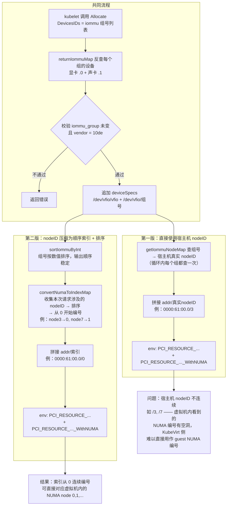

两版差异对比：

| 对比项 | 第一版 | 第二版 |
|---|---|---|
| NUMA 后缀的取值 | 宿主机真实 nodeID（如 `.../3`、`.../7`） | 重新排序后的顺序索引（`.../0`、`.../1`） |
| 为什么必须改 | guest 的 CPU/memory topology 是从 0 连续编号的，宿主机 nodeID 有空洞（如 3、7），**无法直接作为虚拟机 libvirt XML 中的顺序**，导致：<br>① libvirt XML 中 numa 分不出来（设备无法归到正确的 guest vNUMA 节点）<br>② 造成 CPU/内存与设备的错误配对分配 | 索引与 guest NUMA node 0,1,... 一一对应，可直接写入 XML 的 numaNode 属性 |
| 地址顺序 | map 遍历顺序随机，同一 Pod 重启可能得到不同的 env 顺序 | `sortIommuByInt` 按组号数值排序，顺序稳定 |
| `getIommuNodeMap` 调用 | 循环内每组查一次 | 循环外仅查一次 |
| 输出示例（分到 node3、node7 上的两块卡） | `0000:61:00.0/3,0000:41:00.0/7` | `0000:61:00.0/0,0000:41:00.0/1` |

差异总结：

- **第一版**：`_WithNUMA` 后缀直接用宿主机真实 nodeID（`getIommuNodeMap` 在循环内逐组查询），简单直接，但当 Pod 只分到部分卡时，宿主机 nodeID（如 3、7）在虚拟机看来是不连续的，无法直接作为 guest NUMA 编号使用
- **第二版**：三处改进——① `convertNumaToIndexMap` 把本次请求涉及的 nodeID 去重、排序、压缩成从 0 开始的连续索引；② `sortIommuByInt` 对组号做数值排序，使 env 中地址的追加顺序稳定（否则 map 遍历顺序随机，同一 Pod 重启可能得到不同的地址顺序）；③ `getIommuNodeMap` 提到循环外只查一次。代价是引入了一层间接：拿到索引后如果还需要真实 nodeID，要再反查一次


### 2.2.4. NUMA 信息传递的使用（修改 KubeVirt 本身）

注意：从这里开始，我们修改的不再是外围的 device-plugin，而是 **KubeVirt 自身的源码**（virt-launcher 组件）。修改完成后需要重新构建 KubeVirt 镜像部署。

这里我们不再一步步地过流程，如果想知道具体流程，可以看下面这张图：

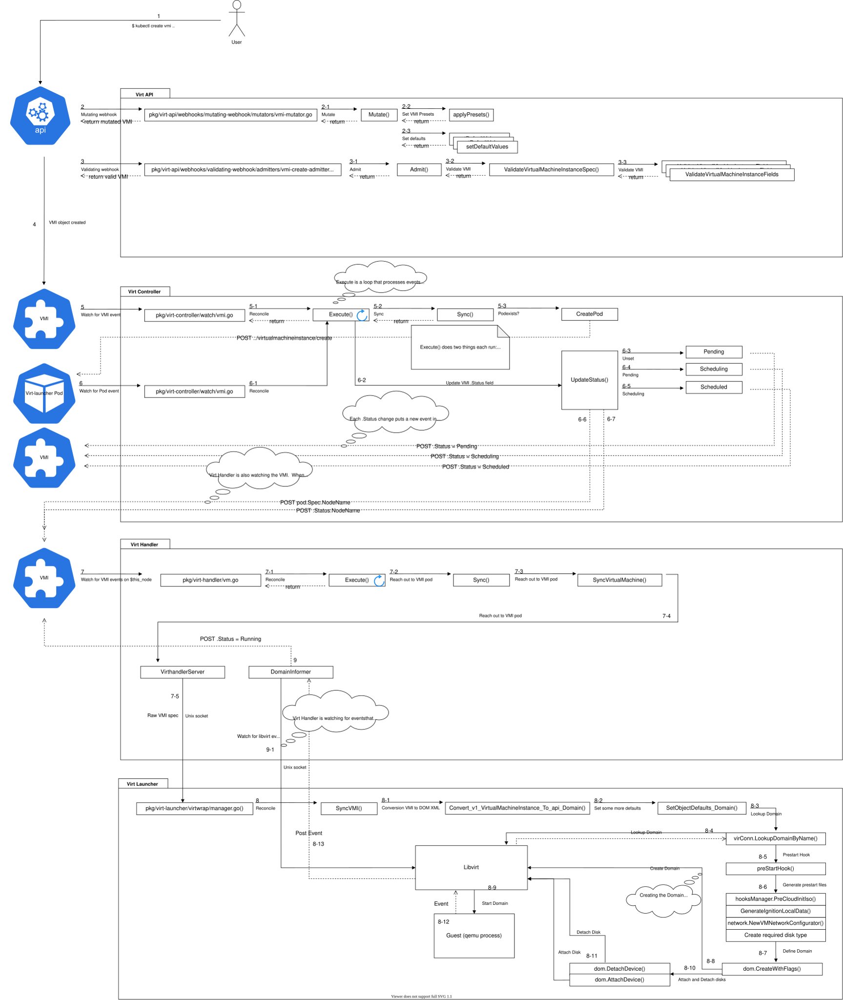

我们可以看到，在流程图中的 8-1 流程中，进行了 VMI 到 libvirt XML 文件的转换。

#### 2.2.4.1. 解析

代码路径：`manager.go/SyncVMI()` --> `generateConverterContext()` --> `gpu/hostdev.go/CreateHostDevices()`

```go
func CreateHostDevices(vmiHostDevices []v1.HostDevice) ([]api.HostDevice, error) {
    return CreateHostDevicesFromPools(vmiGPUs, NewPCIAddressPool(vmiGPUs), NewMDEVAddressPool(vmiGPUs))
}
```

在 VMI 中，GPUs 通常这样来表示：

```
Gpus:
    Device Name:  nvidia.com/GA102_GEFORCE_RTX_3090
    Name:         gpu1
    Device Name:  nvidia.com/GA102_GEFORCE_RTX_3090
    Name:         gpu2
```

那我们来看下 NewPCIAddressPool 做了什么（NewMDEVAddressPool 是 vgpu 的，不需要太关注）：

```go
func NewPCIAddressPool(gpuDevices []v1.GPU) *hostdevice.AddressPool {
    // PCIResourcePrefix等于固定值PCI_RESOURCE
    // extractResources会返回列表。比如上面我们就会形成["nvidia.com/GA102_GEFORCE_RTX_3090"]
    // 并不关心有多少个显卡
    return hostdevice.NewAddressPool(v1.PCIResourcePrefix, extractResources(gpuDevices))
}

func NewAddressPool(resourcePrefix string, resources []string) *AddressPool {
    // 那么我们当前接收到的参数就是: PCI_RESOURCE 和 ["nvidia.com/GA102_GEFORCE_RTX_3090"]
    // 生成一个空的pool
    pool := &AddressPool{
        addressesByResource: make(map[string][]string),
    }
    // 根据resourcePrefix和resources来查找
    pool.load(resourcePrefix, resources)
    return pool
}

func (p *AddressPool) load(resourcePrefix string, resources []string) {
    for _, resource := range resources {
        // 全部转为大写，"/"和"."转换成"_"。 PCI_RESOURCE_NVIDIA_COM_GA102_GEFORCE_RTX_3090，这个就与我们在DevicePlugin中返回的env一致了。
        addressEnvVarName := util.ResourceNameToEnvVar(resourcePrefix, resource)

        // 查找相应的环境变量
        addressString, isSet := os.LookupEnv(addressEnvVarName)
        if !isSet {
            log.Log.Warningf("%s not set for resource %s", addressEnvVarName, resource)
            continue
        }
        // 使用 逗号切割 ，最后就是[0000:41:00.0,0000:41:00.1,0000:61:00.0,0000:61:00.1]
        addressString = strings.TrimSuffix(addressString, ",")
        if addressString != "" {
            p.addressesByResource[resource] = strings.Split(addressString, ",")
        } else {
            p.addressesByResource[resource] = nil
        }
    }
}
```

其实最终就是找到环境变量，然后切成列表：`[0000:41:00.0,0000:41:00.1,0000:61:00.0,0000:61:00.1]`。

如果我们依照这种做法，就会得到带 NUMA 的列表：`[0000:41:00.0/1,0000:41:00.1/1,0000:61:00.0/0,0000:61:00.1/0]`。

#### 2.2.4.2. 修改 load 方法

这里我们的 load 方法添加了 `WithNUMA` 的判断：如果有这个 env，优先使用。

```go
func (p *AddressPool) load(resourcePrefix string, resources []string) {
    for _, resource := range resources {
        addressEnvVarName := util.ResourceNameToEnvVar(resourcePrefix, resource)
        addressEnvVarNameWithNuma := addressEnvVarName + "_WithNUMA"
        addressString, isSet := os.LookupEnv(addressEnvVarName)
        addressStringWithNUMA, isSetWithNUMA := os.LookupEnv(addressEnvVarNameWithNuma)
        if !isSet {
            log.Log.Warningf("%s not set for resource %s", addressEnvVarName, resource)
            if !isSetWithNUMA {
                log.Log.Warningf("neither with numa %s not set for resource %s", addressStringWithNUMA, resource)
            }
        }

        if addressStringWithNUMA == "" {
            addressString = strings.TrimSuffix(addressString, ",")
            if addressString != "" {
                p.addressesByResource[resource] = strings.Split(addressString, ",")
            } else {
                p.addressesByResource[resource] = nil
            }
        } else {
            addressString = strings.TrimSuffix(addressStringWithNUMA, ",")
            if addressString != "" {
                p.addressesByResource[resource] = strings.Split(addressStringWithNUMA, ",")
            } else {
                p.addressesByResource[resource] = nil
            }
        }

    }
}
```

#### 2.2.4.3. 修改 createDevice 方法

下面是完整的 createHostDevices。其中 auxFlag/SubDevice 相关的是 2.2.2 的共存逻辑；SplitPCIAddressIfNuma 与 pxb-pcie 控制器生成是本节的 NUMA 逻辑，两者在这里汇合：

```go
func CreateHostDevices(vmiGPUs []v1.GPU) ([]api.HostDevice, error) {
    return CreateHostDevicesFromPools(vmiGPUs, NewPCIAddressPool(vmiGPUs), NewMDEVAddressPool(vmiGPUs))
}


func NewBestEffortAddressPool(pool AddressPooler) *BestEffortAddressPool {
    return &BestEffortAddressPool{pool}
}

type BestEffortAddressPool struct {
    pool AddressPooler
}

func createHostDevicesMetadata(vmiGPUs []v1.GPU) []hostdevice.HostDeviceMetaData {
    var hostDevicesMetaData []hostdevice.HostDeviceMetaData
    for _, dev := range vmiGPUs {
        hostDevicesMetaData = append(hostDevicesMetaData, hostdevice.HostDeviceMetaData{
            AliasPrefix:       AliasPrefix,
            Name:              dev.Name,
            ResourceName:      dev.DeviceName,
            VirtualGPUOptions: dev.VirtualGPUOptions,
        })
    }
    return hostDevicesMetaData
}

func CreateHostDevicesFromPools(vmiGPUs []v1.GPU, pciAddressPool, mdevAddressPool hostdevice.AddressPooler) ([]api.HostDevice, error) {
    // 这时候我们接收到的参数就是: 包含多个gpu的原始对象，[0000:41:00.0,0000:41:00.1,0000:61:00.0,0000:61:00.1]，vgpu的pool

    // 生成一个新的对象。
    pciPool := hostdevice.NewBestEffortAddressPool(pciAddressPool)
    mdevPool := hostdevice.NewBestEffortAddressPool(mdevAddressPool)

    // 生成一个HostDevicesMetaData对象
    hostDevicesMetaData := createHostDevicesMetadata(vmiGPUs)

    // 生成pciHostDevices对象。我们可以先跳到下面看看它最终生成是什么
    pciHostDevices, err := hostdevice.CreatePCIHostDevices(hostDevicesMetaData, pciPool)
    if err != nil {
        return nil, fmt.Errorf(failedCreateGPUHostDeviceFmt, err)
    }
    mdevHostDevices, err := hostdevice.CreateMDEVHostDevices(hostDevicesMetaData, mdevPool, DefaultDisplayOn)
    if err != nil {
        return nil, fmt.Errorf(failedCreateGPUHostDeviceFmt, err)
    }
    //不管有什么，全部追加到hostDevices中。
    hostDevices := append(pciHostDevices, mdevHostDevices...)

    if err := validateCreationOfAllDevices(vmiGPUs, hostDevices); err != nil {
        return nil, fmt.Errorf(failedCreateGPUHostDeviceFmt, err)
    }

    return hostDevices, nil
}


func CreatePCIHostDevices(hostDevicesData []HostDeviceMetaData, pciAddrPool AddressPooler) ([]api.HostDevice, error) {
    return createHostDevices(hostDevicesData, pciAddrPool, createPCIHostDevice)
}


func createPCIHostDevice(hostDeviceData HostDeviceMetaData, hostPCIAddress string) (*api.HostDevice, error) {
    hostAddr, err := device.NewPciAddressField(hostPCIAddress)
    if err != nil {
        return nil, fmt.Errorf("failed to create PCI device for %s: %v", hostDeviceData.Name, err)
    }
    domainHostDevice := &api.HostDevice{
        Alias:   api.NewUserDefinedAlias(hostDeviceData.AliasPrefix + hostDeviceData.Name),
        Source:  api.HostDeviceSource{Address: hostAddr},
        Type:    api.HostDevicePCI,
        Managed: "no",
    }
    return domainHostDevice, nil
}

type HostDevice struct {
    XMLName   xml.Name         `xml:"hostdev"`
    Source    HostDeviceSource `xml:"source"`
    Type      string           `xml:"type,attr"`
    BootOrder *BootOrder       `xml:"boot,omitempty"`
    Managed   string           `xml:"managed,attr,omitempty"`
    Mode      string           `xml:"mode,attr,omitempty"`
    Model     string           `xml:"model,attr,omitempty"`
    Address   *Address         `xml:"address,omitempty"`
    Alias     *Alias           `xml:"alias,omitempty"`
    Display   string           `xml:"display,attr,omitempty"`
    RamFB     string           `xml:"ramfb,attr,omitempty"`
}


// 在使用load方法创建完成pool后，可以通过该方法来区分deviceplugin是否有传上来numa信息.
func SplitPCIAddressIfNuma(address string) (string, string) {
    // address like this:
    // 0000:61:00.0/0
    // 0000:61:00.1/0
    // 0000:41:00.0/1
    // 0000:41:00.1/1
    realAddress := address
    addressSplit := strings.Split(address, "/")
    if len(addressSplit) == 1 {
        return realAddress, ""
    } else if len(addressSplit) >= 2 {
        realAddress = addressSplit[0]
        numaNode := addressSplit[1]
        return realAddress, numaNode
    }
    return address, ""

}

func createHostDevices(hostDevicesData []HostDeviceMetaData, addrPool AddressPooler, createHostDev createHostDevice) ([]api.HostDevice, error) {
    var (
        hostDevices          []api.HostDevice
        hostDevicesAddresses []string
    )
    var (
        busNR = 40   // define a busNR start number
        index = 20   // define a pci index start number
        //slot  = 10
    )
    newHostDevicesMetaData := map[string][]HostDeviceMetaData{}
    for _, HostDeviceMetaData := range hostDevicesData {
        newHostDevicesMetaData[HostDeviceMetaData.ResourceName] = append(newHostDevicesMetaData[HostDeviceMetaData.ResourceName], HostDeviceMetaData)
    }

    for resourceName, hostDevicesData := range newHostDevicesMetaData {
        // bool of aux device for consumer's cards
        var auxFlag bool
        // count resource request
        reqLen, _ := addrPool.RLen(resourceName)

        // if gpu device not equal reqLen
        if len(newHostDevicesMetaData[resourceName]) != reqLen {
            // if 2*gpu device == reqLen, gpus contains a aux devices
            if 2*len(newHostDevicesMetaData[resourceName]) == reqLen {
                auxFlag = true
            }
        }

        for _, hostDeviceData := range hostDevicesData {
            var auxAddress string
            auxHostDevice := &api.HostDevice{}
            address, err := addrPool.Pop(hostDeviceData.ResourceName)
            if err != nil {
                return nil, fmt.Errorf("failed to pop address for %s: %v", hostDeviceData.ResourceName, err)
            }
            // get numa info from address string split by "/" , but numa may be ""
            address, numa := SplitPCIAddressIfNuma(address)

            if auxFlag {
                auxAddress, err = addrPool.Pop(hostDeviceData.ResourceName)
                if err == nil {
                    auxAddress, _ = SplitPCIAddressIfNuma(auxAddress)
                }

            }

            // if pop succeeded but the address is empty, ignore the device and let the caller
            // decide if this is acceptable or not.
            if address == "" {
                continue
            }

            hostDevice, err := createHostDev(hostDeviceData, address)
            if err != nil {
                return nil, fmt.Errorf(failedCreateHostDeviceFmt, hostDeviceData.Name, err)
            }
            if auxAddress != "" {
                auxHostDevice, err = createHostDev(hostDeviceData, auxAddress)
                if err == nil {
                    // add aux device to gpuDevice's subDevice
                    // move add aux device to the following
                }
            }

            if numa != "" {
                // create pcie expander controller for those devices(gpu and aux)
                PCIEBus, err := createPCIEBus(numa, busNR, index)
                if err != nil {
                    log.Log.Warningf("pci expander controller creation failed: %v", err)
                }

                if PCIEBus != nil {
                    hostDevice.Controller = append(hostDevice.Controller, *PCIEBus)
                    index++
                    PCIERoot, _ := createPcieRoot(index, PCIEBus)
                    hostDevice.Controller = append(hostDevice.Controller, *PCIERoot)
                    attachHostDeviceToController(hostDevice, index, "on", "0")
                    if auxHostDevice != nil {
                        attachHostDeviceToController(auxHostDevice, index, "", "1")
                    }
                }

            }
            // move add aux device to here, beacuse SubnDevice not a pointer
            if auxHostDevice != nil {
                hostDevice.SubDevice = append(hostDevice.SubDevice, *auxHostDevice)
            }

            if hostDeviceData.DecorateHook != nil {
                if err := hostDeviceData.DecorateHook(hostDevice); err != nil {
                    return nil, fmt.Errorf(failedCreateHostDeviceFmt, hostDeviceData.Name, err)
                }
            }

            hostDevices = append(hostDevices, *hostDevice)

            hostDevicesAddresses = append(hostDevicesAddresses, address)
            if auxAddress != "" {
                hostDevicesAddresses = append(hostDevicesAddresses, auxAddress)
            }
            busNR += 3
            index += 2
            //slot += 1
            //Numa++
        }
    }
    if len(hostDevices) > 0 {
        log.Log.Infof("host-devices created: [%s]", strings.Join(hostDevicesAddresses, ", "))
    }
    return hostDevices, nil
}


func attachHostDeviceToController(hostDevice *api.HostDevice, index int, multifunction string, function string) {
    hostDevice.Address = &api.Address{
        Type:   "pci",
        Domain: "0x0000",
        Bus:    "0x" + strconv.FormatInt(int64(index), 16),
    }
    if multifunction != "" {
        hostDevice.Address.Multifunction = multifunction
    }
    if function != "" {
        hostDevice.Address.Function = function
    }
    }

    func createPCIEBus(numaNode string, busNR int, index int) (*api.Controller, error) {
    bus := api.Controller{
        Type:  "pci",
        Index: "0",
        Model: "pcie-expander-bus",
        SubModel: &api.SubModel{
            Name: "pxb-pcie",
        },
        Target: &api.Target{
            BusNr: strconv.Itoa(busNR),
            Node:  numaNode,
        },
        Address: &api.Address{
            Domain: "0x0000",
            Type:   "pci",
            Bus:    "0x00",
            //Slot:   "0x" + strconv.Itoa(slot),
            Slot: "0x00",
        },
    }
    if index != 0 {
        bus.Index = strconv.Itoa(index)
        bus.Address.Slot = "0x" + strconv.FormatInt(int64(index), 16)
    }
    //if slot != 0 {
    // bus.Address.Slot = "0x" + strconv.Itoa(index)
    //}
    return &bus, nil
    }

    func createPcieRoot(index int, PCIEBus *api.Controller) (*api.Controller, error) {
    parentIndex := PCIEBus.Index
    // parentIndex to int
    pIndex, _ := strconv.Atoi(parentIndex)
    bus := api.Controller{
        Type:  "pci",
        Index: "0",
        Model: "pcie-root-port",
        Address: &api.Address{
            Type:     "pci",
            Bus:      "0x" + strconv.FormatInt(int64(pIndex), 16),
            Domain:   "0x0000",
            Slot:     "0x00",
            Function: "0x00",
        },
    }
    if index != 0 {
        bus.Index = strconv.Itoa(index)
        // convert to hex
        //indexHex := "0x" + strconv.FormatInt(int64(index), 16)
        //bus.Target = &api.Target{}
        //bus.Target.Port = indexHex
    }

    return &bus, nil
}
```

本节（2.2.4）的内部流程，即 virt-launcher 从读到 env 到生成 libvirt XML 的过程：

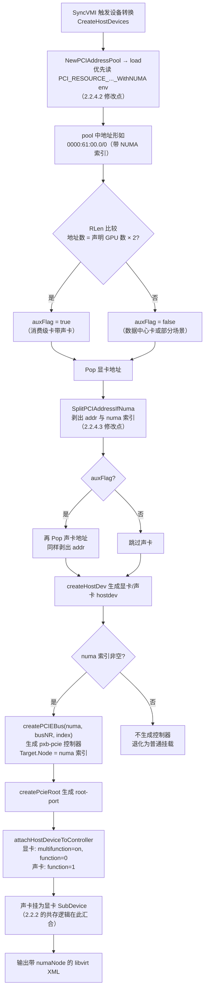

再放大视角，把全文（第 1 章 + 第 2 章）的修改串成一条完整链路：

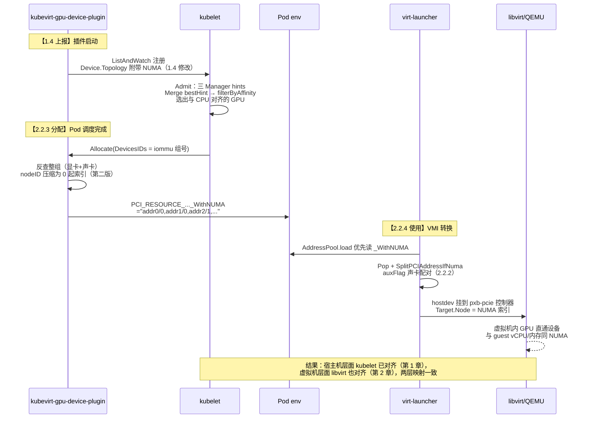

两个视角的关系：2.2.4 的流程图是上图中"【2.2.4 使用】"阶段的放大；而 Allocate 之前的上报与决策细节分别在 1.4 和 2.2.1.2。

## 2.3. 总结


### 2.3.1. 修改后

修改后，我们终于把这个十分"拧巴"的 GPU 分配机制搞定了：让它能对虚拟机进行 NUMA 映射，最终实现了性能上的提升。

回顾整个方案，共修改了两个项目，解决了三个问题：

| 问题 | 修改项目 | 修改点 |
|---|---|---|
| 设备拓扑上报 | kubevirt-gpu-device-plugin（nvidia） | 第 1 章：Device.Topology 附带 NUMA 信息 |
| 显卡与声卡的共存 | KubeVirt 本身 | 2.2.2：auxFlag 成对 Pop；声卡挂为显卡 SubDevice |
| NUMA 信息传递 | kubevirt-gpu-device-plugin（nvidia） | 2.2.3：allocate 返回 `_WithNUMA` 环境变量 |
| NUMA 信息的使用 | KubeVirt 本身 | 2.2.4：AddressPool.load 解析 `_WithNUMA`；createHostDevices 按 NUMA 生成 pxb-pcie 控制器 |

配合第 1 章的 kubelet 配置（static CPU + restricted topology），完整链路为：device-plugin 上报拓扑 → kubelet NUMA 匹配分配 CPU 与设备 → allocate 注入 NUMA env → KubeVirt 按 env 生成带 NUMA 的 libvirt XML → 虚拟机的 GPU 挂载到正确的 NUMA 节点。

### 2.3.2. 端到端最详细时序图

从 kubelet 启动、插件注册，到虚拟机内 GPU 生效的全过程，包含每一处修改点（以【】标注）和关键源码函数：

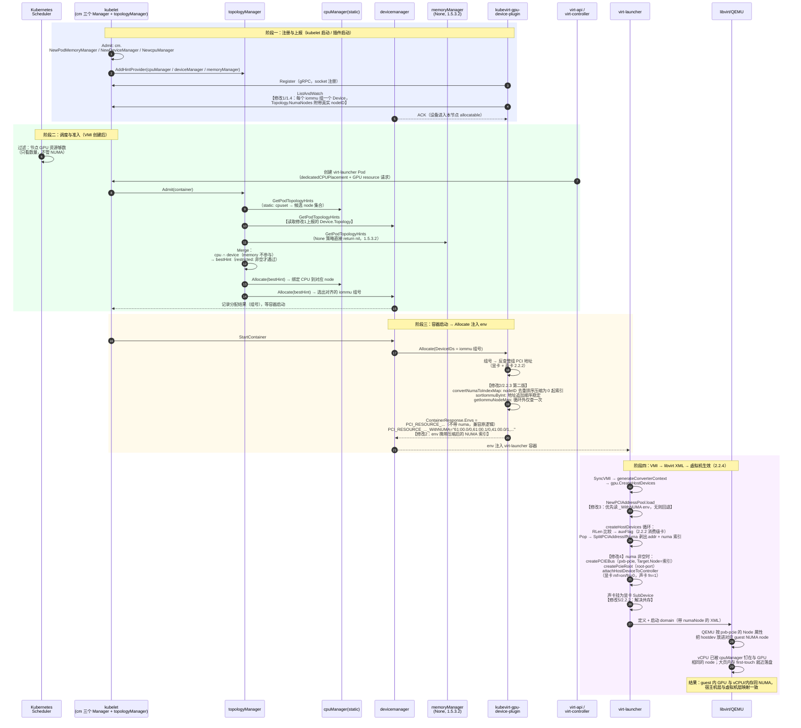

四个阶段与全文的对应关系：阶段一 = 1.4 + 2.2.1.2（上报）；阶段二 = 1.3.2（三个子 Manager + Merge）+ 1.5.3.2；阶段三 = 2.2.2 + 2.2.3（分配与 env 注入）；阶段四 = 2.2.4（使用）。图中的五处【修改】即 2.3.1 表格所列四个问题的落点（修改 2、4 同属 NUMA 传递链路）。

