# Longhorn 存储原理与使用指南

本项目通过 [Longhorn](https://longhorn.io/) 提供分布式块存储，作为 Kubernetes
集群的默认 StorageClass。本文说明其工作原理、数据路径，以及
VictoriaMetrics / VictoriaLogs 如何使用它。

- 相关配置：`globals.yaml` 中 `存储 - Longhorn` 一节
- Role 文件：`roles/longhorn/`
- 默认 StorageClass：`longhorn`（`enable_longhorn: true` 时自动设为默认）

> **重要：两种"副本"不要混淆**
>
> | 层次 | 关键词 | 作用 | 默认值 | 由谁负责 |
> |------|--------|------|-------|---------|
> | **存储副本** | `longhorn_replica_count` | 磁盘数据的物理冗余 | `2` | Longhorn |
> | **应用副本** | `victoria_metrics_cluster_enabled` | VM 进程的横向扩展 | `false` | VM chart |
>
> 本文只讨论**存储副本**。应用层 HA 见 [victoria-metrics.md](./victoria-metrics.md)。

---

## 1. Longhorn 是什么

Longhorn 是专为 Kubernetes 设计的**分布式块存储**（Distributed Block Storage）。
每个卷 = 一个独立的存储引擎 + N 个副本，以 Pod 形式运行在集群节点上。

**核心特征：**

| 特性 | 说明 |
|------|------|
| 架构 | 每个卷 = 1 个 Engine + N 个 Replica，都是用户态进程 |
| 前端 | iSCSI（v1 引擎，默认）/ NVMe-oF（v2 引擎，可选） |
| 副本 | 同步复制到多个节点，写完成 = 所有副本确认 |
| 快照 | 增量快照，Copy-on-Write 链 |
| 备份 | 增量备份到 CIFS / NFS / S3 |
| 精简置备 | 稀疏文件，按需分配 |
| 动态供应 | StorageClass 自动创建 PV |

---

## 2. 组件全景

Longhorn 部署后在 `kube-system` 和 `longhorn-system` 两个 namespace 中运行：

### kube-system

| 组件 | 类型 | 每节点 | 作用 |
|------|------|--------|------|
| **longhorn-manager** | DaemonSet | ✅ | 大脑：管理卷 CRUD、副本调度、节点监控 |
| **longhorn-csi-plugin** | DaemonSet | ✅ | CSI 驱动：实现 CSI gRPC 接口，含 3 个容器（plugin + node-driver-registrar + liveness-probe） |
| **csi-provisioner** | Deployment | 1 | CSI 侧车：watch PVC → 调用 csi-plugin 的 CreateVolume |
| **csi-attacher** | Deployment | 1 | CSI 侧车：watch VolumeAttachment → 调用 csi-plugin 的 ControllerPublishVolume |
| **csi-snapshotter** | Deployment | 1 | CSI 侧车：watch VolumeSnapshot → 调用 csi-plugin 的 CreateSnapshot |
| **csi-resizer** | Deployment | 1 | CSI 侧车：watch PVC resize → 调用 csi-plugin 的 ControllerExpandVolume |
| **longhorn-driver-deployer** | Deployment | 1 | 安装器：部署上述 CSI 侧车组件 |
| **longhorn-ui** | Deployment | 2 | Web 管理界面 |

> CSI 侧车用标准镜像（如 `longhornio/csi-provisioner:v5.3.0`），通过 hostPath
> 挂载 `/var/lib/kubelet/plugins/driver.longhorn.io/csi.sock` 连接同节点的
> csi-plugin。pod 名不带 `longhorn-` 前缀，但用 Longhorn 的 service account
> 和 socket。集群里可以有多组同名 csi-provisioner（每个 CSI 驱动一组），
> 靠 StorageClass 的 `provisioner` 字段区分。

### longhorn-system

| 组件 | 作用 |
|------|------|
| **instance-manager** | 运行在 longhorn-manager pod 内部，管理 engine/replica 进程 |
| **engine** | 每卷 1 个，iSCSI target，接收写请求并同步到所有 replica |
| **replica** | 每卷 N 个（=副本数），实际存储数据到本地磁盘 |

> **注意**：instance-manager、engine、replica **不是独立 Pod**。
> 它们是 longhorn-manager pod 内的子进程，`kubectl get pods` 看不到。
> 用 `kubectl get engines.longhorn.io` 和 `kubectl get replicas.longhorn.io` 查看。

### K8s Services

Longhorn chart 创建了 4 个 Service，用于组件间通信：

| Service | 端口 | 类型 | 作用 |
|---------|------|------|------|
| **longhorn-backend** | 9500 | ClusterIP | longhorn-manager API 主入口。CSI plugin、Longhorn UI、longhornctl 都通过它操作卷 |
| **longhorn-admission-webhook** | 9502 | ClusterIP | 准入校验。拦截 K8s API 对 Longhorn CRD 的操作（创建/删除/修改），校验合法性。比如删除有副本的节点时阻止 |
| **longhorn-recovery-backend** | 9503 | ClusterIP | 紧急恢复。节点宕机后强制 detach 卷、从备份恢复数据等特殊操作 |
| **longhorn-frontend** | 80 | ClusterIP | Longhorn UI Web 界面 |

### CSI 三层调用架构

Longhorn 遵循标准 CSI 规范。CSI 侧车和 kubelet 都通过**本地 Unix socket**
连接 csi-plugin，csi-plugin 再通过 K8s Service 连接 longhorn-manager：

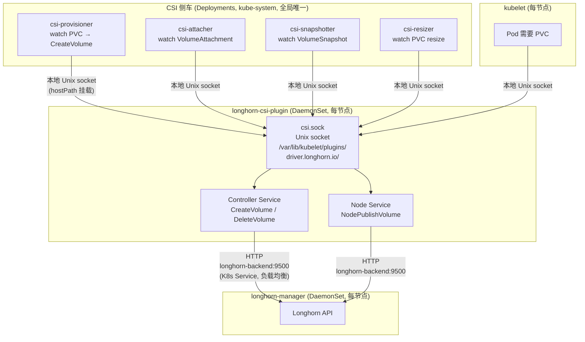

**调用方式说明：**

| 调用方 → 被调用方 | 通信方式 | 说明 |
|-------------------|---------|------|
| CSI 侧车 → csi-plugin | 本地 Unix socket (hostPath) | csi-provisioner 等是 Deployment，跑在某个节点上，连接该节点的 csi-plugin |
| kubelet → csi-plugin | 本地 Unix socket | kubelet 每节点都有，连接本节点的 csi-plugin |
| csi-plugin → longhorn-manager | HTTP over longhorn-backend:9500 | 唯一走 K8s Service 的环节，负载均衡到任意 manager |

> **CSI 侧车不是 K8s 核心组件**：csi-provisioner、csi-attacher 等是 Longhorn
> chart 通过 longhorn-driver-deployer 部署的外部 Pod。它们用标准 CSI 侧车
> 镜像（如 `longhornio/csi-provisioner:v5.3.0`），连接 Longhorn 的 socket。
> 集群里可以有多组 csi-provisioner（每个 CSI 驱动一组），靠 StorageClass
> 的 `provisioner` 字段区分（Longhorn = `driver.longhorn.io`）。

---

## 3. 工作原理

Longhorn 的卷生命周期分为两个独立阶段：**Provisioning**（创建卷 + 副本）和
**Attachment**（Pod 调度后创建 Engine 并挂载）。两个阶段可以分开触发，也可以
连续完成。

> **关键区别**：
> - PVC 可以**独立创建**，不需要 Pod（只有 Replica，没有 Engine）
> - Engine 只有在 Pod 需要挂载卷时才创建（因为 iSCSI 要走本地回环）

### 3.1 与 K8s 的依赖关系

Longhorn 是 K8s 原生存储，控制面完全依赖 K8s，数据面独立：

| 层面 | 依赖 K8s？ | 说明 |
|------|-----------|------|
| **控制面** | ✅ 完全依赖 | 状态存 etcd（CRD）、变更靠 K8s watch、卷 CRUD 走 CSI → K8s API |
| **数据面** | ❌ 独立 | iSCSI → Engine → TCP → Replica，直连不走 K8s |

K8s API server 挂了之后：

| 场景 | 能否工作 | 原因 |
|------|---------|------|
| 已挂载的卷读写 | ✅ | Engine/Replica 进程已启动，直连 TCP |
| 副本间数据同步 | ✅ | TCP 直连，不走 K8s |
| 创建/删除卷 | ❌ | CSI Provisioner 需要 K8s API |
| Pod 重启后挂载 | ❌ | CSI Attacher 需要 K8s API |
| 节点故障检测 | ❌ | longhorn-manager 靠 K8s watch 感知 |
| 副本重建 | ❌ | 需要 longhorn-manager API |

和 Ceph 的本质区别：

```
Ceph:     控制面 Mon 仲裁（独立 Paxos）   数据面 OSD 间复制   ← 离了 K8s 照跑
Longhorn: 控制面 = K8s CRD + etcd         数据面 = Engine→Replica TCP   ← 离了 K8s 控制面全瘫
```

### 3.2 阶段 1：Provisioning（创建卷，不需要 Pod）

PVC 可以独立创建——只要有 CSI Provisioner 和 longhorn-manager 在运行：

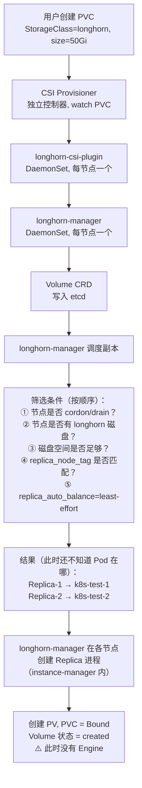

此时卷已创建、副本已分布、PVC 已 Bound，但**没有 Engine**，不能读写。
`data_locality=best-effort` 的"优先 Pod 同节点"逻辑在这个阶段不生效——
因为 Pod 还没被调度，不知道放哪个节点。

### 3.3 阶段 2：Attachment（Pod 调度后创建 Engine 并挂载）

当 Pod 被调度到某节点后，kubelet 触发挂载流程：

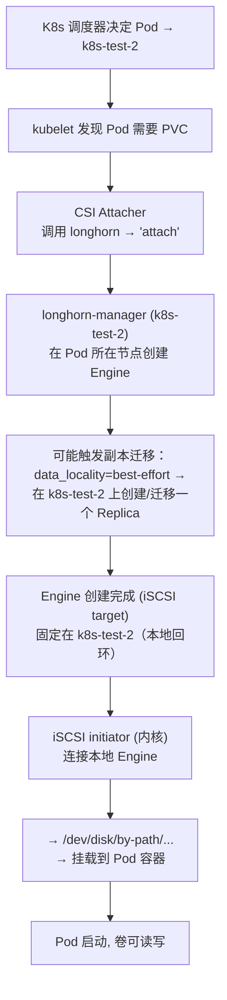

**两个阶段的时间线对比：**

```
时间 ──────────────────────────────────────────────────────►

阶段 1 (Provisioning)          阶段 2 (Attachment)
─────────────────────          ──────────────────────
PVC 创建                        Pod 调度到节点
  │                               │
  ▼                               ▼
CSI Provisioner                 kubelet 触发
  │                               │
  ▼                               ▼
longhorn-manager                CSI Attacher
  │                               │
  ▼                               ▼
创建 Volume CRD                 longhorn-manager
  │                               │
  ▼                               ▼
选节点, 创建 Replica             创建 Engine (Pod 节点)
  │                               │
  ▼                               ▼
PV 创建, PVC Bound              iSCSI 挂载, Pod 启动

  ← 可能间隔几秒到几天 →
```

> 如果 Pod 和 PVC 同时创建（如 Helm chart 部署），两个阶段会连续完成，
> 看起来像一个流程。但内部仍然是两步。

### 3.4 写入数据路径

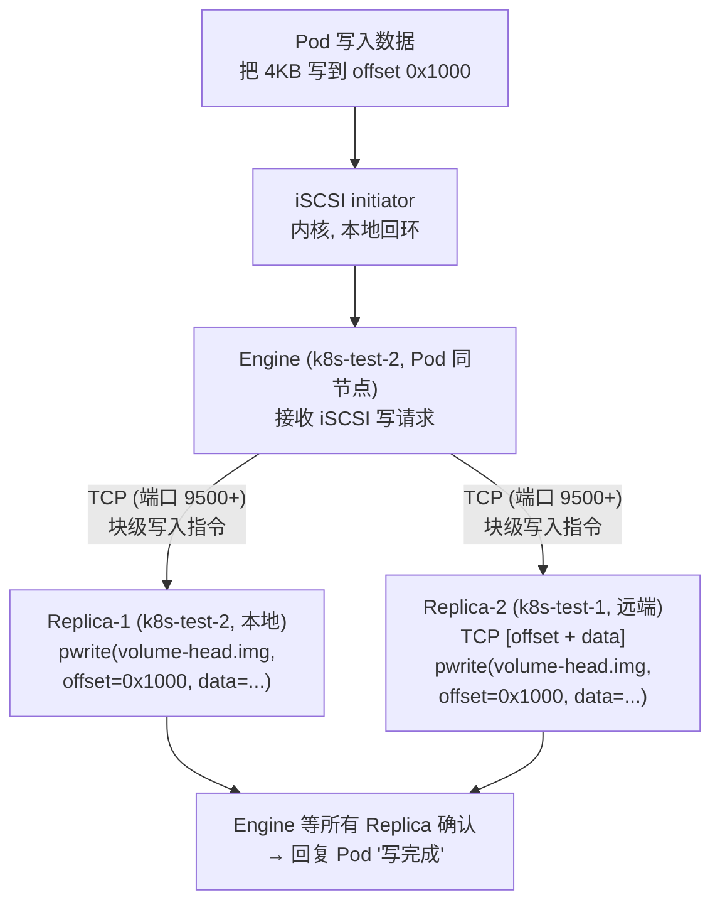

**关键点：**
- 传输的是 `[offset + data]` 块级写入指令，**不是文件传输**
- 类似 RAID 1 的网络镜像
- 同步复制：Engine 等所有 Replica 确认后才回复 Pod
- 写性能 = 最慢的 Replica 的响应时间

### 3.5 读取数据路径

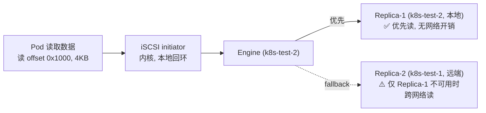

读默认走同节点的 Replica，不产生跨网络流量。

---

## 4. 本地存储格式

每个 Replica 在节点的 `/var/lib/longhorn/replicas/<pvc-id>-<hash>/` 下存储数据：

```
/var/lib/longhorn/replicas/pvc-1af59d16-...-08b93d81/
├── volume-head-002.img              ← 活跃写入层（当前写操作的目标）
├── volume-head-002.img.meta         ← head 元数据
├── volume-snap-1849776d-...img      ← 快照层（只读）
├── volume-snap-1849776d-...img.meta ← 快照元数据
└── volume.meta                       ← 卷级元数据
```

**稀疏文件：**
```
$ ls -lh volume-head-002.img
-rw-r--r-- 1 root root 50G    ← 虚拟大小（卷容量）

$ du -sh volume-head-002.img
3.2G                         ← 实际磁盘占用（只算写过的块）
```

`.img` 文件是稀疏文件，`ls` 显示虚拟大小，`du` 显示实际占用。

---

## 5. 快照（Snapshot）机制

### 5.1 Copy-on-Write 链

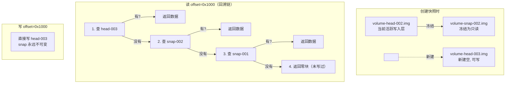

### 5.2 快照的作用

| 作用 | 说明 |
|------|------|
| **增量备份** | 备份只传相邻 snap 之间变化的块，不传整个卷 |
| **一致性快照** | 快照是只读的，备份时不受并发写入影响 |
| **副本重建** | 副本恢复时只传差异块，不重传整个卷 |
| **卷回滚** | revert 到某个 snap，丢弃之后的写入 |

### 5.3 备份流程

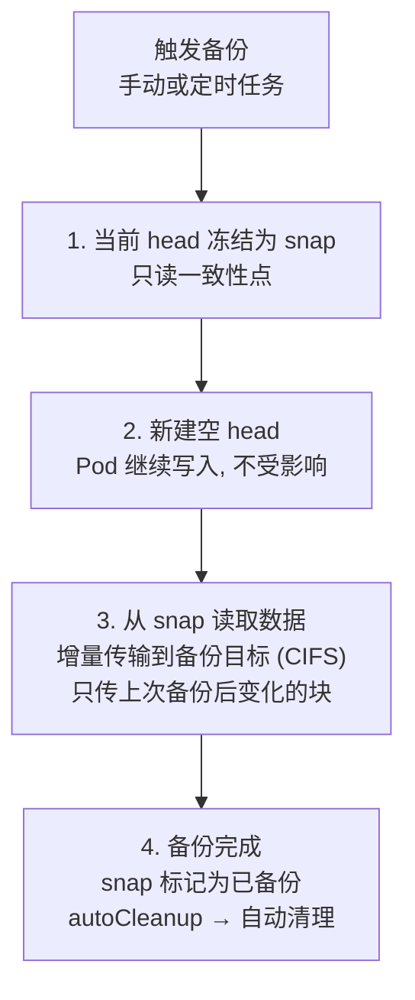

---

## 6. 默认配置

本项目 `globals.yaml` 中的默认值：

| 配置 | 默认值 | 说明 |
|------|--------|------|
| `longhorn_replica_count` | `2` | 每个卷 2 份数据副本 |
| `longhorn_backup_enabled` | `true` | 开启备份 |
| `longhorn_backup_target` | `cifs://nas.noty.cc/backup` | 备份目标（用户需修改） |
| `longhorn_data_locality` | `best-effort` | 尽量在 Pod 节点放副本 |
| `longhorn_replica_node_tag` | `""` | 不限制副本节点 |
| 存储路径 | `/var/lib/longhorn/` | 每个节点的数据目录 |
| 引擎版本 | `v1`（iSCSI） | 默认数据引擎 |
| 自动均衡 | `least-effort` | 尽量均匀但少迁移 |
| 节点驱逐 | `block-for-eviction` | drain 时先迁移副本 |
| 快照清理 | `auto` | 系统/备份产生的 snap 自动清理 |

---

## 7. VictoriaMetrics / VictoriaLogs 如何使用 Longhorn

### 7.1 组件 PVC 一览

| 组件 | PVC 大小 | 用途 | StorageClass |
|------|---------|------|-------------|
| **vmsingle** | 50Gi | TSDB 时序数据存储 | longhorn |
| **grafana** | 5Gi | 仪表盘、用户、配置 | longhorn |
| **vlsingle** (VictoriaLogs) | 5Gi | 日志存储 | longhorn |
| vmagent | 无（emptyDir） | 临时缓冲，无需持久化 | — |
| vmalert | 无 | 无状态规则引擎 | — |
| alertmanager | 5Gi (默认禁用) | 告警静音状态 | longhorn |

### 7.2 数据布局（2 节点集群示例）

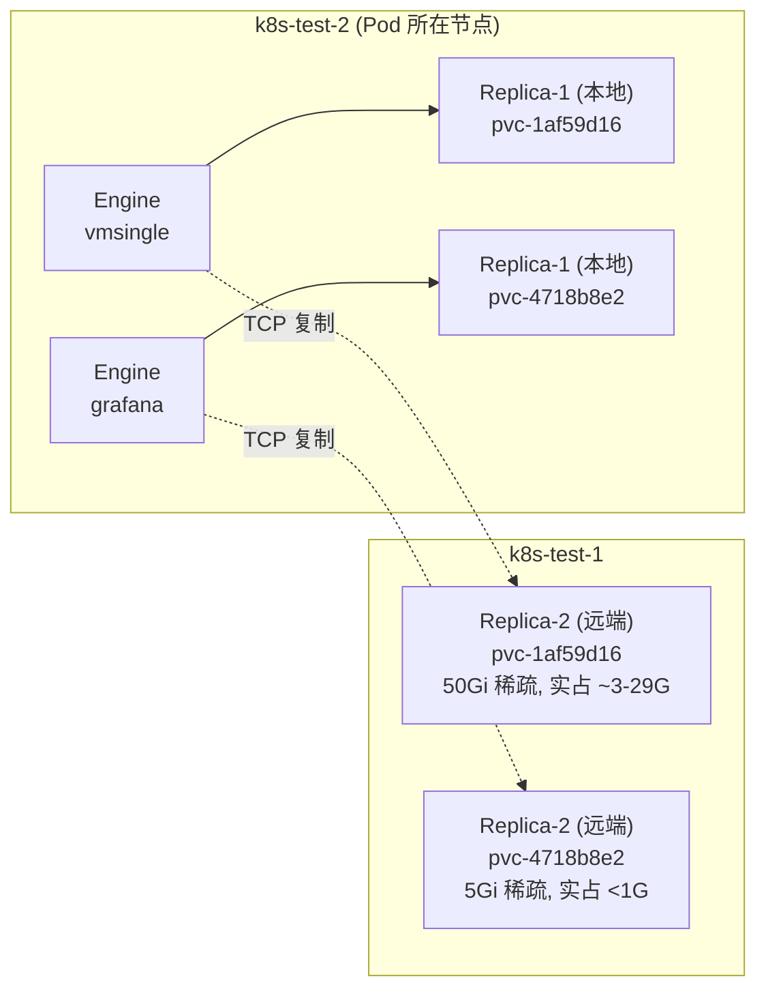

每个 Engine 固定在 Pod 所在节点，2 个 Replica 分布在两个节点上保证数据冗余。

### 7.3 写入路径（VictoriaMetrics 视角）

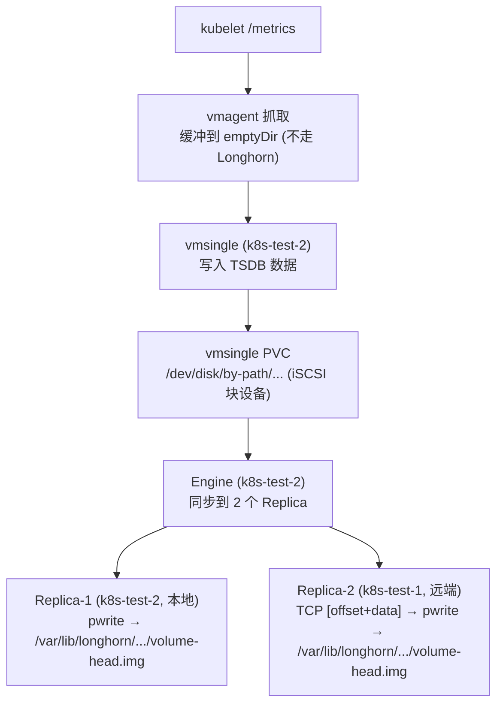

### 7.4 故障场景

**场景 1：k8s-test-1 磁盘故障**

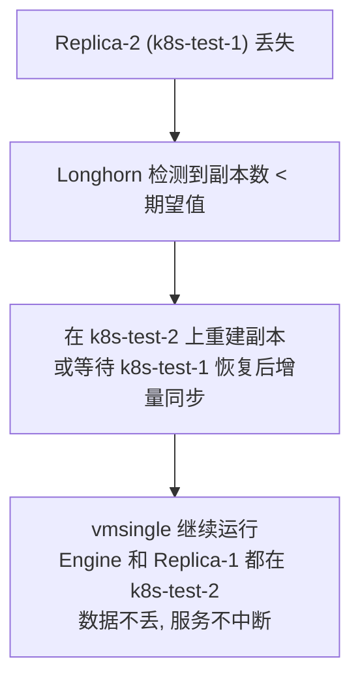

**场景 2：k8s-test-2 宕机（Pod 所在节点）**

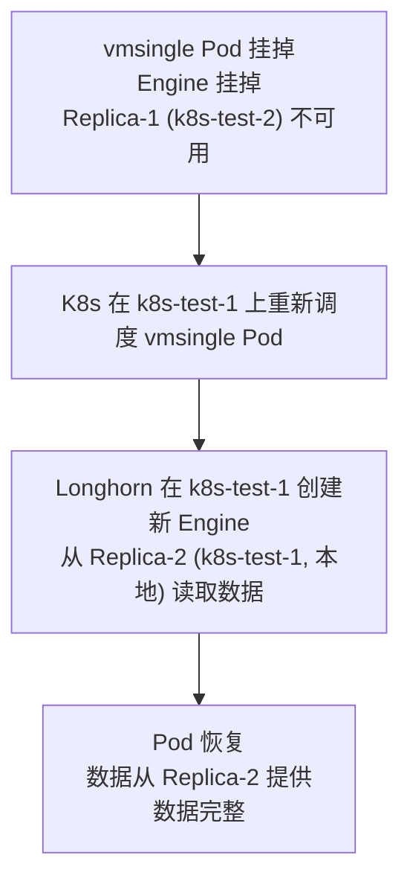

**场景 3：全部节点宕机**

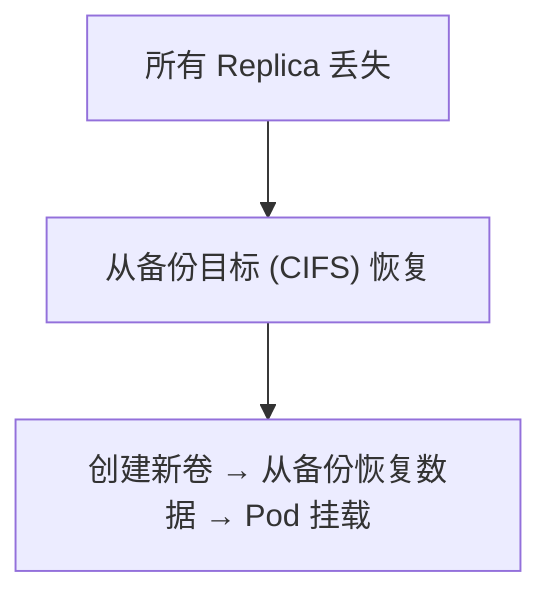

---

## 8. 常见运维操作

### 查看卷状态

```bash
# 所有卷
kubectl get volumes.longhorn.io -n longhorn-system

# 引擎（每个卷一个，显示在哪个节点）
kubectl get engines.longhorn.io -n kube-system

# 副本（每个卷 N 个，显示分布）
kubectl get replicas.longhorn.io -n kube-system

# PVC
kubectl -n kube-system get pvc
```

### 查看实际磁盘占用

```bash
# 每个节点的 Longhorn 数据
du -sh /var/lib/longhorn/replicas/*/

# 单个卷
du -sh /var/lib/longhorn/replicas/pvc-1af59d16-*/
```

### 限制副本到指定节点

```yaml
# globals.yaml
longhorn_replica_node_tag: "storage"
```

```bash
# 给节点打 tag
longhornctl update node k8s-test-1 --tags storage
longhornctl update node k8s-test-2 --tags storage
```

### 更换存储后端

```yaml
# globals.yaml — 关闭 Longhorn，用 local-path
enable_longhorn: false
# 所有组件自动切换到 local-path StorageClass
```

```yaml
# 或切换到外部 Ceph
enable_longhorn: false
enable_ceph_csi: true
cluster_storage_class: "ceph-rbd"
```

---

## 9. 与其他存储方案对比

| | Longhorn | Ceph CSI | local-path |
|---|---------|----------|------------|
| 类型 | 分布式块存储 | 分布式块存储 | 本地目录 |
| 数据冗余 | 内置（应用层复制） | 内置（底层复制） | 无 |
| 节点故障 | 数据不丢 | 数据不丢 | 数据丢 |
| 写性能 | 中（同步复制） | 中（同步复制） | 高（无开销） |
| 部署 | Helm chart，简单 | 需要外部 Ceph 集群 | K3s 内置 |
| 适合 | 中小规模集群 | 大规模、已有 Ceph | 临时/单节点 |
| 备份 | 内置 CIFS/NFS/S3 | Ceph 自身 | 无 |

---

## 10. 相关配置

| 变量 | 位置 | 说明 |
|------|------|------|
| `enable_longhorn` | globals.yaml | 是否部署 Longhorn |
| `longhorn_replica_count` | globals.yaml | 卷副本数（默认 2） |
| `longhorn_backup_enabled` | globals.yaml | 是否开启备份 |
| `longhorn_backup_target` | globals.yaml | 备份目标 URL |
| `longhorn_data_locality` | globals.yaml | 数据本地性策略 |
| `longhorn_replica_node_tag` | globals.yaml | 限制副本节点 |
| `longhorn_chart_version` | globals.yaml | Helm chart 版本 |
| `longhorn_cli_version` | globals.yaml | longhornctl 版本 |
| `cluster_storage_class` | globals.yaml | 覆盖默认 StorageClass |

完整变量列表见 `globals-sample.yaml` 的 `存储 - Longhorn` 一节。
